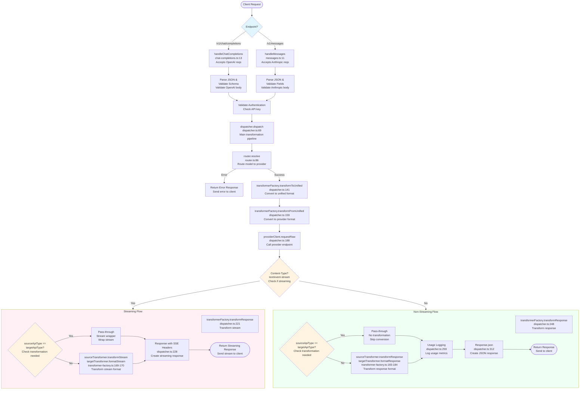

# Request/Response Transformation Flow

This document traces the complete request/response transformation flow through Plexus for both supported endpoints and request modes.

## Overview

Plexus supports two client-facing endpoints:
- **`POST /v1/chat/completions`** - OpenAI-compatible API
- **`POST /v1/messages`** - Anthropic-compatible API

Each endpoint supports both:
- **Unary (non-streaming)** requests
- **Streaming** requests

The transformation pipeline uses a unified format as an intermediate representation, enabling cross-provider routing without requiring clients to change their code.

---

## Common Flow (All Endpoints & Modes)

### 1. Initial Request Acceptance

| Endpoint | Handler | Router Line | Handler File | Handler Line |
|----------|---------|-------------|--------------|--------------|
| Chat Completions | `handleChatCompletions` | `server.ts:103` | `routes/chat-completions.ts` | 13 |
| Messages | `handleMessages` | `server.ts:107` | `routes/messages.ts` | 11 |

The router determines the endpoint from the request path and creates a correlation `requestId`.

---

### 2. Request Parsing & Validation

#### `/v1/chat/completions`
**Function:** `handleChatCompletions`  
**File:** `routes/chat-completions.ts`  
**Lines:** 29, 43

- Line 29: `body = await req.json()` - Parses JSON body
- Line 43: `OpenAIChatCompletionRequestSchema.parse(body)` - Validates against OpenAI schema using Zod

#### `/v1/messages`
**Function:** `handleMessages`  
**File:** `routes/messages.ts`  
**Lines:** 50, 61-83

- Line 50: `body = await req.json()` - Parses JSON body
- Lines 61-83: Manual validation of required Anthropic Messages API fields (`model`, `messages`, `max_tokens`)

**Note:** Streaming requests include a `stream: true` parameter in the body, which is validated along with other fields.

---

### 3. Route Resolution

**Function:** `router.resolve`  
**File:** `services/router.ts`  
**Lines:** 86-189

The dispatcher calls the router to resolve the requested model to a concrete provider/model target:
- Resolves model aliases to actual providers/models
- Applies selection strategies (round-robin, random, static)
- Filters out disabled providers and providers on cooldown

---

### 4. Transformation to Unified Format

**Function:** `transformerFactory.transformToUnified`  
**File:** `services/dispatcher.ts`  
**Lines:** 141-144

The flow:
- `dispatcher.ts:69-94` - `dispatch()` method starts with `clientApiType` (either `"chat"` or `"messages"`)
- `dispatcher.ts:141-144` - Calls `transformerFactory.transformToUnified(request, clientApiType)`
- `transformer-factory.ts:92-98` - Gets the appropriate transformer and calls `transformer.parseRequest(request)`

**Transformer Selection:**
- `"chat"` → `OpenAITransformer.parseRequest()` - Converts OpenAI format to unified
- `"messages"` → `AnthropicTransformer.parseRequest()` - Converts Anthropic format to unified

---

### 5. Transformation from Unified to Provider Format

**Function:** `transformerFactory.transformFromUnified`  
**File:** `services/dispatcher.ts`  
**Lines:** 159-162

The flow:
- `dispatcher.ts:122` - Determines the provider's native API type via `getProviderApiType()`
- `dispatcher.ts:159-162` - Calls `transformerFactory.transformFromUnified(unifiedRequest, providerApiType)`
- `transformer-factory.ts:106-112` - Gets provider transformer and calls `transformer.transformRequest(unifiedRequest)`

**Provider API Types:** `"chat"` (OpenAI), `"messages"` (Anthropic), `"gemini"`

---

### 6. Making the Request to Provider

**Function:** `ProviderClient.requestRaw`  
**File:** `services/dispatcher.ts`  
**Lines:** 180, 186-193

The flow:
- `dispatcher.ts:180` - Gets endpoint URL via `getEndpointUrl()` (returns `provider.baseUrls.messages` or `provider.baseUrls.chat` based on API type)
- `dispatcher.ts:186` - Creates `ProviderClient` instance
- `dispatcher.ts:188-193` - Calls `client.requestRaw({ method, url, body, requestId })`

---

## Mode-Specific Flow Divergence

After the provider response is received, the flow diverges based on whether it's streaming or non-streaming.

---

## Unary (Non-Streaming) Flow

### 7a. Response Transformation

**Function:** `transformerFactory.transformResponse`  
**File:** `services/dispatcher.ts`  
**Lines:** 206, 248-252

**Are all responses converted to unified format?** 

**No.** If `sourceApiType === targetApiType`, the response passes through without conversion (optimization at `transformer-factory.ts:131-149`). Otherwise, the response is transformed.

The flow:
- `dispatcher.ts:206` - Checks if streaming by examining `Content-Type` header
- `dispatcher.ts:248-252` - For non-streaming: Calls `transformerFactory.transformResponse(providerResponse, providerApiType, clientApiType)`
- `transformer-factory.ts:180-189` - If types match: returns wrapped response; if different: converts to unified then to target format

### 8a. Response Translation (if API types differ)

**Function:** `sourceTransformer.transformResponse` → `targetTransformer.formatResponse`  
**File:** `services/transformer-factory.ts`  
**Lines:** 183-184

Called only when `sourceApiType !== targetApiType`:

- Line 183: `unifiedResponse = await sourceTransformer.transformResponse(data)` - Converts provider response to unified format
- Line 184: `targetResponse = await targetTransformer.formatResponse(unifiedResponse)` - Converts unified format to client expected format

### 9a. Usage Logging

**Function:** `usageLogger.logRequest`  
**File:** `services/dispatcher.ts`  
**Lines:** 259-322

For non-streaming requests:
- Parses response body to extract usage information
- Calls `transformer.parseUsage(rawUsage)` to normalize usage metrics (handles differences like `prompt_tokens` vs `input_tokens`)
- Logs request with usage data for observability

### 10a. Final Response to Client

**Function:** `Response.json` (returned from handler)  
**File:** `routes/chat-completions.ts:72` or `routes/messages.ts:104`

The flow:
- `dispatcher.ts:312-315` - Creates Response with JSON body
- Handler returns the Response object to client

---

## Streaming Flow

### 7b. Detecting Streaming Response

**Function:** `dispatcher.dispatch`  
**File:** `services/dispatcher.ts`  
**Lines:** 206, 212-217

- Line 206: `const isStreaming = providerResponse.headers.get("Content-Type")?.includes("text/event-stream")` - Checks if response is streaming
- Line 208-210: Updates request context with streaming flag
- Lines 212-217: Enters streaming path and logs debug info

### 8b. Stream Transformation to Client Format

**Function:** `transformerFactory.transformResponse`  
**File:** `services/dispatcher.ts`  
**Lines:** 221-225

The flow:
- `dispatcher.ts:221-225` - Calls `transformerFactory.transformResponse(providerResponse, providerApiType, clientApiType)` for streaming
- `transformer-factory.ts:159-178` - Streaming transformation path:
  - Line 164-166: Checks that both `transformStream` and `formatStream` methods are available
  - Line 169: `unifiedStream = sourceTransformer.transformStream(response.body, debugOptions)` - Converts provider stream to unified stream
  - Line 170: `targetStream = targetTransformer.formatStream(unifiedStream, debugOptions)` - Converts unified stream to client format

**Stream Pipeline:** Provider Stream → Unified Stream → Client Format Stream

**Note:** Streaming responses are passed through directly without usage interception. Usage logging for streaming requests is not currently implemented.

### 9b. Final Streaming Response to Client

**Function:** `Response` (returned from handler)  
**File:** `routes/chat-completions.ts:72` or `routes/messages.ts:104`

The flow:
- `dispatcher.ts:236-244` - Creates streaming Response with SSE headers:
  ```typescript
  return new Response(stream, {
    status: transformedResponse.status,
    headers: {
      "Content-Type": "text/event-stream",
      "Cache-Control": "no-cache",
      "Connection": "keep-alive",
      "X-Accel-Buffering": "no",
    },
  });
  ```
- Handler returns the streaming Response object to client

---

## Summary Key Points

1. **Unified Format:** All requests pass through a unified format, enabling cross-provider routing
2. **Transformation Optimization:** If `sourceApiType === targetApiType`, responses pass through without transformation
3. **Stream Interception:** Streaming responses are intercepted for usage extraction while maintaining pass-through semantics
4. **Usage Normalization:** Usage metrics are normalized (`prompt_tokens` vs `input_tokens`) via `transformer.parseUsage()`
5. **Observability:** Both streaming and non-streaming requests log usage, metrics, and debug information

---

## Flow Diagram


