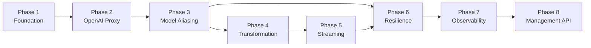
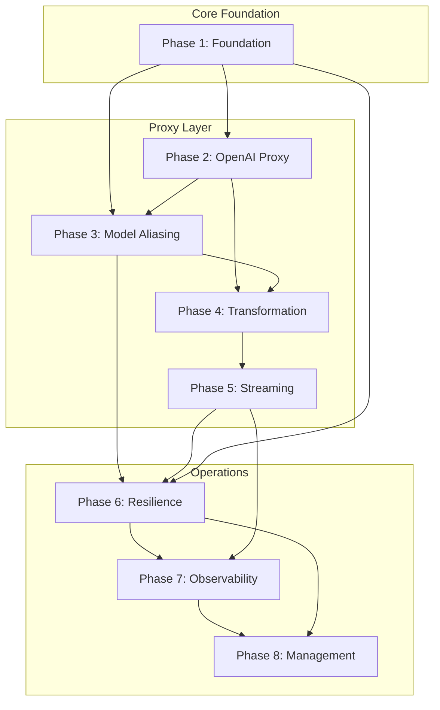

# Plexus 2 Implementation Plan

This directory contains the phased implementation plan for Plexus 2, a unified API gateway and virtualization layer for Large Language Models.

## Overview

The implementation is divided into 8 incremental phases, each building on the previous and delivering testable functionality.



## Phase Summary

| Phase | Name | Key Deliverables |
|-------|------|------------------|
| [1](PHASE1.md) | Foundation & Project Setup | Bun server, config system, health endpoints |
| [2](PHASE2.md) | OpenAI Passthrough Proxy | `/v1/chat/completions`, auth, provider client |
| [3](PHASE3.md) | Configuration & Model Aliasing | Router, selectors, `/v1/models` endpoint |
| [4](PHASE4.md) | Anthropic API & Transformation | `/v1/messages`, request/response transformation |
| [5](PHASE5.md) | Streaming Support | SSE streaming, stream transformation, TTFT |
| [6](PHASE6.md) | Resilience & Health | Cooldown system, health filtering, persistence |
| [7](PHASE7.md) | Observability & Logging | Usage logging, cost calculation, metrics |
| [8](PHASE8.md) | Management API | `/v0/config`, `/v0/state`, `/v0/logs`, `/v0/events` |

## Dependency Graph



## Milestone Checkpoints

After each phase, you should be able to verify specific functionality:

### After Phase 1
```bash
curl http://localhost:4000/health
# Returns: {"status":"ok","version":"0.1.0",...}
```

### After Phase 2
```bash
curl -X POST http://localhost:4000/v1/chat/completions \
  -H "Authorization: Bearer your-key" \
  -H "Content-Type: application/json" \
  -d '{"model":"gpt-4o","messages":[{"role":"user","content":"Hi"}]}'
# Returns: OpenAI-format completion from OpenAI provider
```

### After Phase 3
```bash
curl http://localhost:4000/v1/models -H "Authorization: Bearer your-key"
# Returns: List of configured model aliases
```

### After Phase 4
```bash
# Send Anthropic-format request, routes to any provider
curl -X POST http://localhost:4000/v1/messages \
  -H "x-api-key: your-key" \
  -H "Content-Type: application/json" \
  -d '{"model":"smart","max_tokens":100,"messages":[{"role":"user","content":"Hi"}]}'
```

### After Phase 5
```bash
# Streaming works with transformation
curl -N -X POST http://localhost:4000/v1/chat/completions \
  -H "Authorization: Bearer your-key" \
  -H "Content-Type: application/json" \
  -d '{"model":"fast","stream":true,"messages":[{"role":"user","content":"Count to 5"}]}'
```

### After Phase 6
```bash
# Health shows provider status
curl "http://localhost:4000/health?detail=true"
# Shows cooldowns and provider health
```

### After Phase 7
```bash
# Usage logs are being captured
cat data/logs/usage/$(date +%Y-%m-%d).jsonl | jq
# Shows detailed request logs with costs
```

### After Phase 8
```bash
# Full management API available
curl http://localhost:4000/v0/state -H "Authorization: Bearer admin-key"
# Returns system state, providers, cooldowns, metrics
```

## Technical Decisions

### Why These Phases?

1. **Phase 1 first** - Everything depends on foundation
2. **OpenAI before Anthropic** - More common client format
3. **Aliasing before transformation** - Establishes routing patterns
4. **Transformation before streaming** - Non-streaming is simpler
5. **Streaming before resilience** - Streaming errors inform cooldown design
6. **Resilience before observability** - Cooldowns generate events to log
7. **Observability before management** - Management API queries stored data
8. **Management last** - Ties everything together

### Key Architectural Choices

- **Bun runtime** - Fast startup, native TypeScript, web-standard APIs
- **YAML configuration** - Human-readable, supports comments
- **Zod validation** - Type-safe config with clear error messages
- **JSONL storage** - Simple append-only logs, easy to process
- **SSE for events** - Standard protocol, works with web clients
- **Transformer library** - Leverage `@musistudio/llms` for format conversion

## Getting Started

1. Read [PHASE1.md](PHASE1.md) to understand the foundation
2. Follow phases in order - each builds on previous
3. Run verification steps after each phase
4. Test thoroughly before moving to next phase

## File Naming Convention

- `PHASE{N}.md` - Detailed phase specification
- Each phase document contains:
  - Objective and success criteria
  - Deliverables and file structure
  - Type definitions
  - Implementation tasks
  - Test scenarios
  - Verification steps
  - Dependencies

## Notes

- **No time estimates** - Focus on capability delivery, not scheduling
- **Iterative testing** - Each phase is independently testable
- **Documentation first** - Types and interfaces defined before implementation
- **No frontend** - Dashboard is out of scope per AGENTS.md
