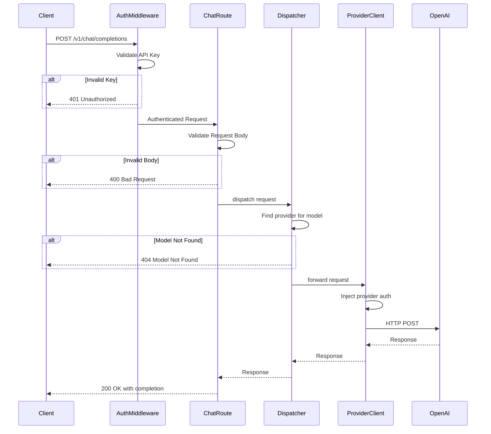

# Phase 2: OpenAI Passthrough Proxy

## Objective
Implement a basic proxy that accepts OpenAI-compatible `/v1/chat/completions` requests and forwards them directly to an OpenAI-compatible backend provider without transformation. This establishes the core request/response flow and validates the proxy architecture before adding complexity.

---

## Success Criteria
- [ ] POST `/v1/chat/completions` accepts valid OpenAI chat completion requests
- [ ] Requests are forwarded to a configured OpenAI-compatible provider
- [ ] Non-streaming responses are returned correctly to the client
- [ ] API key authentication validates incoming requests
- [ ] Provider API key is injected for outbound requests
- [ ] Error responses from providers are properly propagated
- [ ] Request/response headers are handled correctly

---

## Deliverables

### 1. New/Modified Files
```
packages/backend/src/
├── routes/
│   ├── health.ts                  # (from Phase 1)
│   └── chat-completions.ts        # NEW: /v1/chat/completions handler
├── services/
│   ├── dispatcher.ts              # NEW: Request orchestration
│   └── provider-client.ts         # NEW: HTTP client for providers
├── types/
│   ├── config.ts                  # MODIFIED: Add provider config
│   ├── openai.ts                  # NEW: OpenAI request/response types
│   └── errors.ts                  # NEW: Error type definitions
├── middleware/
│   └── auth.ts                    # NEW: API key authentication
└── utils/
    └── headers.ts                 # NEW: Header manipulation utilities
```

### 2. Extended Configuration Schema
```yaml
# config/plexus.yaml
server:
  port: 4000
  host: "0.0.0.0"

logging:
  level: "info"

providers:
  - name: "openai"
    enabled: true
    apiTypes:
      - "chat"
    baseUrls:
      chat: "https://api.openai.com/v1/chat/completions"
    auth:
      type: "bearer"
      apiKeyEnv: "OPENAI_API_KEY"   # Read from environment
    models:
      - "gpt-4o"
      - "gpt-4o-mini"
      - "gpt-4-turbo"

apiKeys:
  - name: "default"
    secret: "${PLEXUS_API_KEY}"     # Client-facing API key
    enabled: true
```

### 3. Type Definitions

```typescript
// packages/backend/src/types/config.ts (extended)
interface ProviderAuth {
  type: "bearer" | "x-api-key";
  apiKeyEnv: string;
}

interface ProviderConfig {
  name: string;
  enabled: boolean;
  apiTypes: Array<"chat" | "messages" | "gemini">;
  baseUrls: {
    chat?: string;
    messages?: string;
    gemini?: string;
  };
  auth: ProviderAuth;
  models: string[];
  customHeaders?: Record<string, string>;
  extraBody?: Record<string, unknown>;
}

interface ApiKeyConfig {
  name: string;
  secret: string;
  enabled: boolean;
}
```

```typescript
// packages/backend/src/types/openai.ts
interface OpenAIChatMessage {
  role: "system" | "user" | "assistant" | "tool";
  content: string | null;
  name?: string;
  tool_calls?: OpenAIToolCall[];
  tool_call_id?: string;
}

interface OpenAIChatCompletionRequest {
  model: string;
  messages: OpenAIChatMessage[];
  temperature?: number;
  top_p?: number;
  n?: number;
  stream?: boolean;
  stop?: string | string[];
  max_tokens?: number;
  presence_penalty?: number;
  frequency_penalty?: number;
  user?: string;
  tools?: OpenAITool[];
  tool_choice?: "none" | "auto" | "required" | OpenAIToolChoice;
}

interface OpenAIChatCompletionResponse {
  id: string;
  object: "chat.completion";
  created: number;
  model: string;
  choices: OpenAIChoice[];
  usage: OpenAIUsage;
  system_fingerprint?: string;
}

interface OpenAIChoice {
  index: number;
  message: OpenAIChatMessage;
  finish_reason: "stop" | "length" | "tool_calls" | "content_filter";
}

interface OpenAIUsage {
  prompt_tokens: number;
  completion_tokens: number;
  total_tokens: number;
}
```

```typescript
// packages/backend/src/types/errors.ts
interface PlexusError {
  error: {
    type: string;
    message: string;
    code?: string;
    param?: string;
  };
}

type ErrorType = 
  | "authentication_error"
  | "invalid_request_error"
  | "rate_limit_error"
  | "api_error"
  | "provider_error";
```

### 4. API Endpoints

#### POST /v1/chat/completions

**Request Headers:**
```
Authorization: Bearer <plexus-api-key>
Content-Type: application/json
```

**Request Body:** Standard OpenAI chat completion request

**Response (non-streaming):** Standard OpenAI chat completion response

**Error Responses:**
| Status | Type | Description |
|--------|------|-------------|
| 400 | invalid_request_error | Malformed request body |
| 401 | authentication_error | Missing or invalid API key |
| 404 | invalid_request_error | Model not found/configured |
| 429 | rate_limit_error | Provider rate limit hit |
| 500 | api_error | Internal server error |
| 502 | provider_error | Provider returned error |

---

## Implementation Tasks

### Authentication Middleware
- [ ] Create `auth.ts` middleware to extract Bearer token from Authorization header
- [ ] Validate token against configured `apiKeys` list
- [ ] Return 401 with OpenAI-compatible error format for invalid keys
- [ ] Attach authenticated key info to request context for logging

### Provider Client
- [ ] Create `provider-client.ts` with fetch-based HTTP client
- [ ] Implement provider authentication (inject Bearer token or x-api-key)
- [ ] Handle provider custom headers from configuration
- [ ] Set appropriate timeouts (configurable, default 120s)
- [ ] Preserve relevant request headers (accept-encoding, etc.)

### Dispatcher Service
- [ ] Create `dispatcher.ts` as the main request orchestration service
- [ ] Implement provider lookup by model name
- [ ] Validate that requested model exists in a configured provider
- [ ] Delegate HTTP call to provider client
- [ ] Handle and transform provider errors

### Chat Completions Route
- [ ] Create route handler for `POST /v1/chat/completions`
- [ ] Parse and validate request body against OpenAI schema
- [ ] Extract model from request to determine provider
- [ ] Call dispatcher to execute the request
- [ ] Return provider response directly (passthrough mode)

### Header Utilities
- [ ] Create utility to sanitize/filter headers for forwarding
- [ ] Strip hop-by-hop headers (connection, keep-alive, etc.)
- [ ] Add X-Request-ID for correlation

### Error Handling
- [ ] Create error type definitions matching OpenAI format
- [ ] Implement error transformation for provider errors
- [ ] Map HTTP status codes appropriately
- [ ] Include helpful error messages for debugging

---

## Architecture Diagram



---

## Test Scenarios

### Authentication Tests
| Test Case | Input | Expected Result |
|-----------|-------|-----------------|
| Valid API key | Bearer valid-key | Request proceeds |
| Missing header | No Authorization | 401 with auth_error |
| Invalid format | Basic credentials | 401 with auth_error |
| Invalid key | Bearer wrong-key | 401 with auth_error |
| Disabled key | Bearer disabled-key | 401 with auth_error |

### Request Validation Tests
| Test Case | Input | Expected Result |
|-----------|-------|-----------------|
| Valid request | Complete chat request | Request proceeds |
| Missing model | No model field | 400 invalid_request |
| Missing messages | No messages array | 400 invalid_request |
| Invalid role | role: "invalid" | 400 invalid_request |
| Empty messages | messages: [] | 400 invalid_request |

### Provider Routing Tests
| Test Case | Input | Expected Result |
|-----------|-------|-----------------|
| Known model | model: "gpt-4o" | Routes to OpenAI |
| Unknown model | model: "unknown-model" | 404 model not found |
| Disabled provider | Provider disabled | 404 no provider available |

### Response Handling Tests
| Test Case | Provider Response | Expected Client Response |
|-----------|-------------------|-------------------------|
| Success | 200 with completion | 200 with same body |
| Rate limit | 429 | 429 with error body |
| Auth error | 401 | 502 provider_error |
| Server error | 500 | 502 provider_error |
| Timeout | No response | 504 timeout |

---

## Verification Steps

```bash
# 1. Start the server with OpenAI key configured
OPENAI_API_KEY=sk-xxx PLEXUS_API_KEY=test-key bun run dev

# 2. Test authentication failure
curl -X POST http://localhost:4000/v1/chat/completions \
  -H "Content-Type: application/json" \
  -d '{"model": "gpt-4o", "messages": [{"role": "user", "content": "Hi"}]}'
# Expected: 401 Unauthorized

# 3. Test successful passthrough
curl -X POST http://localhost:4000/v1/chat/completions \
  -H "Authorization: Bearer test-key" \
  -H "Content-Type: application/json" \
  -d '{"model": "gpt-4o", "messages": [{"role": "user", "content": "Say hello"}]}'
# Expected: 200 with OpenAI completion response

# 4. Test unknown model
curl -X POST http://localhost:4000/v1/chat/completions \
  -H "Authorization: Bearer test-key" \
  -H "Content-Type: application/json" \
  -d '{"model": "nonexistent", "messages": [{"role": "user", "content": "Hi"}]}'
# Expected: 404 Model not found

# 5. Run unit tests
bun test
```

---

## Notes & Decisions

### Why Passthrough First?
- Validates the proxy architecture with minimal complexity
- Allows testing with real providers immediately
- Establishes patterns for request/response flow
- Streaming and transformation can be added incrementally

### Error Format Choice
Using OpenAI's error format as the standard because:
- Most client libraries expect this format
- Well-documented and understood
- Can be transformed to Anthropic format when needed (Phase 4)

### Timeout Strategy
- Default 120 seconds (LLM responses can be slow)
- Configurable per-provider in later phases
- Streaming in Phase 5 will have different timeout semantics

---

## Dependencies on Other Phases
- **Phase 1**: Project structure, configuration system, logging

## Phases That Depend on This
- **Phase 3**: Configuration & Model Aliasing (extends provider config)
- **Phase 4**: Anthropic API Support (parallel endpoint)
- **Phase 5**: Streaming Support (adds streaming to this endpoint)
