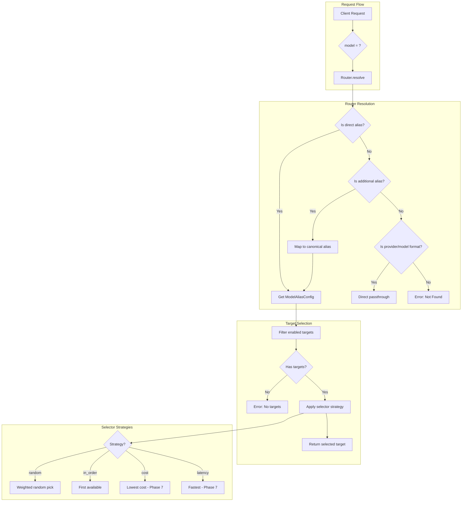

# Phase 3: Configuration & Model Aliasing

## Objective
Implement the model aliasing and routing system that decouples client-facing model names from actual provider implementations. This enables transparent provider switching, A/B testing, and multi-target load balancing without client code changes.

---

## Success Criteria
- [ ] Model aliases resolve to one or more provider/model targets
- [ ] Multiple targets per alias with configurable selection strategies
- [ ] Random selection strategy distributes requests across targets
- [ ] Round-robin selection rotates through targets in order
- [ ] GET `/v1/models` endpoint lists available aliases
- [ ] Additional aliases (synonyms) route to the canonical alias
- [ ] Configuration validation catches invalid alias definitions

---

## Deliverables

### 1. New/Modified Files
```
packages/backend/src/
├── services/
│   ├── dispatcher.ts              # MODIFIED: Use router for model resolution
│   ├── router.ts                  # NEW: Model alias resolution
│   └── selector.ts                # NEW: Target selection strategies
├── routes/
│   └── models.ts                  # NEW: /v1/models endpoint
├── types/
│   ├── config.ts                  # MODIFIED: Add model alias types
│   └── routing.ts                 # NEW: Routing type definitions
└── tests/
    ├── router.test.ts             # NEW: Router unit tests
    └── selector.test.ts           # NEW: Selector unit tests
```

### 2. Extended Configuration Schema
```yaml
# config/plexus.yaml
server:
  port: 4000
  host: "0.0.0.0"

logging:
  level: "info"

providers:
  - name: "openai"
    enabled: true
    apiTypes: ["chat"]
    baseUrls:
      chat: "https://api.openai.com/v1/chat/completions"
    auth:
      type: "bearer"
      apiKeyEnv: "OPENAI_API_KEY"
    models:
      - "gpt-4o"
      - "gpt-4o-mini"
      - "gpt-4-turbo"
      
  - name: "azure-openai"
    enabled: true
    apiTypes: ["chat"]
    baseUrls:
      chat: "https://my-resource.openai.azure.com/openai/deployments/gpt4o/chat/completions?api-version=2024-02-01"
    auth:
      type: "x-api-key"
      apiKeyEnv: "AZURE_OPENAI_KEY"
    models:
      - "gpt-4o"

# NEW: Model alias definitions
models:
  - alias: "fast"
    description: "Fast, cost-effective model for simple tasks"
    additionalAliases:
      - "quick"
      - "cheap"
    targets:
      - provider: "openai"
        model: "gpt-4o-mini"
    selector: "random"

  - alias: "smart"
    description: "High-quality model for complex tasks"
    additionalAliases:
      - "best"
      - "flagship"
    targets:
      - provider: "openai"
        model: "gpt-4o"
        weight: 70
      - provider: "azure-openai"
        model: "gpt-4o"
        weight: 30
    selector: "random"

  - alias: "balanced"
    description: "Cost-balanced model with fallback"
    targets:
      - provider: "openai"
        model: "gpt-4-turbo"
      - provider: "openai"
        model: "gpt-4o"
    selector: "in_order"  # Try first, fall back to second

apiKeys:
  - name: "default"
    secret: "${PLEXUS_API_KEY}"
    enabled: true
```

### 3. Type Definitions

```typescript
// packages/backend/src/types/config.ts (extended)
interface ModelTarget {
  provider: string;
  model: string;
  weight?: number;  // For weighted random selection
}

type SelectorStrategy = "random" | "in_order" | "cost" | "latency" | "performance";

interface ModelAliasConfig {
  alias: string;
  description?: string;
  additionalAliases?: string[];
  targets: ModelTarget[];
  selector: SelectorStrategy;
  apiMatch?: boolean;  // Prefer targets matching incoming API type
}
```

```typescript
// packages/backend/src/types/routing.ts
interface ResolvedTarget {
  provider: ProviderConfig;
  model: string;
  aliasUsed: string;
  targetIndex: number;
}

interface RouteResolutionResult {
  success: true;
  target: ResolvedTarget;
} | {
  success: false;
  error: string;
  code: "ALIAS_NOT_FOUND" | "NO_ENABLED_TARGETS" | "PROVIDER_NOT_FOUND";
}

interface TargetWithProvider extends ModelTarget {
  providerConfig: ProviderConfig;
  healthy: boolean;  // For future health-based filtering
}
```

### 4. API Endpoints

#### GET /v1/models

Returns available models in OpenAI-compatible format.

**Response:**
```json
{
  "object": "list",
  "data": [
    {
      "id": "fast",
      "object": "model",
      "created": 1700000000,
      "owned_by": "plexus",
      "description": "Fast, cost-effective model for simple tasks"
    },
    {
      "id": "smart",
      "object": "model",
      "created": 1700000000,
      "owned_by": "plexus",
      "description": "High-quality model for complex tasks"
    },
    {
      "id": "quick",
      "object": "model",
      "created": 1700000000,
      "owned_by": "plexus",
      "description": "Alias for: fast"
    }
  ]
}
```

---

## Implementation Tasks

### Router Service
- [ ] Create `router.ts` service for model alias resolution
- [ ] Build lookup maps on configuration load:
  - `aliasMap`: alias → ModelAliasConfig
  - `additionalAliasMap`: additional alias → canonical alias
  - `providerMap`: provider name → ProviderConfig
- [ ] Implement `resolve(modelName)` method:
  - Check if model is a direct alias
  - Check if model is an additional alias
  - Check if model matches a raw provider/model (passthrough)
  - Return error if not found
- [ ] Filter targets to enabled providers
- [ ] Rebuild maps when configuration reloads

### Selector Strategies
- [ ] Create `selector.ts` with strategy implementations
- [ ] Implement `random` selector:
  - Uniform random if no weights specified
  - Weighted random respects `weight` values
- [ ] Implement `in_order` selector:
  - Returns first available target
  - Used for fallback/failover patterns
- [ ] Create `SelectionContext` for passing state:
  - Previous attempts (for failover)
  - Incoming API type (for api_match)
  - Performance metrics (for future strategies)
- [ ] Stub `cost`, `latency`, `performance` selectors for later phases

### Models Endpoint
- [ ] Create `models.ts` route handler
- [ ] Generate model list from configuration:
  - Include all canonical aliases
  - Include all additional aliases
  - Add descriptions
- [ ] Use consistent `created` timestamp (config load time)
- [ ] Ensure OpenAI-compatible response format

### Dispatcher Integration
- [ ] Modify `dispatcher.ts` to use Router service
- [ ] Update request context with routing information:
  - Alias used
  - Actual provider/model resolved
  - Selection strategy used
- [ ] Handle routing errors with appropriate HTTP status codes

### Configuration Validation
- [ ] Validate alias names are unique across all aliases
- [ ] Validate target providers exist in providers list
- [ ] Validate target models exist in provider's model list
- [ ] Warn on disabled providers referenced by aliases
- [ ] Validate selector strategy is known

---

## Architecture Diagram



---

## Test Scenarios

### Alias Resolution Tests
| Test Case | Input Model | Expected Result |
|-----------|-------------|-----------------|
| Direct alias | "fast" | Resolves to gpt-4o-mini |
| Additional alias | "quick" | Resolves to gpt-4o-mini via "fast" |
| Another additional | "cheap" | Resolves to gpt-4o-mini via "fast" |
| Unknown alias | "unknown" | Error: ALIAS_NOT_FOUND |
| Case sensitivity | "FAST" | Error: ALIAS_NOT_FOUND |

### Target Selection Tests
| Test Case | Config | Expected Behavior |
|-----------|--------|-------------------|
| Single target | 1 target, random | Always returns that target |
| Multiple, random | 2 targets equal weight | ~50/50 distribution |
| Weighted random | 70/30 weights | ~70/30 distribution |
| In-order, all healthy | 2 targets | Always returns first |
| Provider disabled | Target provider disabled | Target filtered out |
| All providers disabled | All targets disabled | Error: NO_ENABLED_TARGETS |

### Models Endpoint Tests
| Test Case | Expected Result |
|-----------|-----------------|
| List all models | Returns all aliases + additional aliases |
| Additional alias | Shows "Alias for: X" in description |
| Empty config | Returns empty data array |
| Disabled aliases not shown | Hidden from list |

### Configuration Validation Tests
| Test Case | Config Problem | Expected Error |
|-----------|----------------|----------------|
| Duplicate alias | Two aliases named "fast" | Duplicate alias name |
| Unknown provider | target.provider = "unknown" | Provider not found |
| Unknown model | target.model = "nonexistent" | Model not in provider |
| Invalid selector | selector = "invalid" | Unknown selector strategy |

---

## Verification Steps

```bash
# 1. Update configuration with model aliases
# Edit config/plexus.yaml per the schema above

# 2. Start the server
bun run dev

# 3. List available models
curl http://localhost:4000/v1/models \
  -H "Authorization: Bearer test-key"
# Expected: List of aliases with descriptions

# 4. Use an alias
curl -X POST http://localhost:4000/v1/chat/completions \
  -H "Authorization: Bearer test-key" \
  -H "Content-Type: application/json" \
  -d '{"model": "fast", "messages": [{"role": "user", "content": "Hi"}]}'
# Expected: Routes to gpt-4o-mini

# 5. Use additional alias
curl -X POST http://localhost:4000/v1/chat/completions \
  -H "Authorization: Bearer test-key" \
  -H "Content-Type: application/json" \
  -d '{"model": "quick", "messages": [{"role": "user", "content": "Hi"}]}'
# Expected: Same as "fast"

# 6. Test unknown model
curl -X POST http://localhost:4000/v1/chat/completions \
  -H "Authorization: Bearer test-key" \
  -H "Content-Type: application/json" \
  -d '{"model": "nonexistent", "messages": [{"role": "user", "content": "Hi"}]}'
# Expected: 404 Model not found

# 7. Verify weighted distribution (multiple requests)
for i in {1..100}; do
  curl -s -X POST http://localhost:4000/v1/chat/completions \
    -H "Authorization: Bearer test-key" \
    -H "Content-Type: application/json" \
    -d '{"model": "smart", "messages": [{"role": "user", "content": "Hi"}]}' \
    | jq -r '.model'
done | sort | uniq -c
# Expected: ~70 openai, ~30 azure-openai

# 8. Run unit tests
bun test
```

---

## Notes & Decisions

### Alias vs. Raw Model Names
The router should support both:
1. **Aliases**: Virtual names that map to targets
2. **Raw provider/model**: Direct specification like "openai/gpt-4o"

This provides flexibility while maintaining the abstraction.

### Weight Semantics
- Weights are relative, not percentages
- `weight: 70` and `weight: 30` → 70% and 30%
- `weight: 2` and `weight: 1` → 66% and 33%
- Omitted weight defaults to 1

### Selector Strategy Extension Points
- Phase 6 adds health-based filtering before selection
- Phase 7 adds cost and latency selectors using metrics
- Strategy interface allows easy addition of custom selectors

### Configuration Reload
- Router must rebuild maps when config changes
- Selection state (e.g., round-robin counter) may reset on reload
- Document this behavior for users

---

## Dependencies on Other Phases
- **Phase 1**: Configuration system, logging
- **Phase 2**: Dispatcher service, provider definitions

## Phases That Depend on This
- **Phase 4**: Uses routing for Anthropic → OpenAI cross-provider
- **Phase 5**: Routing context passed through streaming
- **Phase 6**: Health filtering integrates with selector
- **Phase 7**: Cost/latency selectors use metrics from observability
