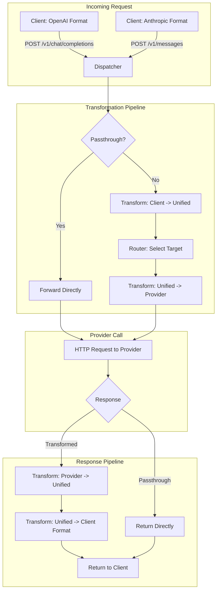
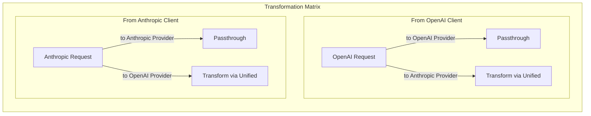

# Phase 4: Anthropic API Support & Transformation

## Objective
Implement the Anthropic Messages API endpoint (`/v1/messages`) and the transformation layer that enables cross-provider routing. This phase introduces the `@musistudio/llms` transformer library to convert between OpenAI and Anthropic request/response formats, enabling scenarios like sending Anthropic-style requests to OpenAI providers and vice versa.

---

## Success Criteria
- [ ] POST `/v1/messages` accepts valid Anthropic Messages API requests
- [ ] Anthropic requests can be routed to Anthropic providers (passthrough)
- [ ] Anthropic requests can be transformed and routed to OpenAI providers
- [ ] OpenAI requests (Phase 2) can be transformed and routed to Anthropic providers
- [ ] Response transformation converts provider format back to client expected format
- [ ] Tool/function definitions are translated between formats
- [ ] System messages are handled correctly in both directions
- [ ] Non-streaming responses work in all transformation scenarios

---

## Deliverables

### 1. New/Modified Files
```
packages/backend/src/
├── routes/
│   └── messages.ts                # NEW: /v1/messages Anthropic endpoint
├── services/
│   ├── dispatcher.ts              # MODIFIED: Add transformation logic
│   ├── transformer-factory.ts     # NEW: Instantiates transformers
│   └── router.ts                  # MODIFIED: API type matching
├── transformers/
│   ├── index.ts                   # NEW: Transformer exports
│   ├── openai.ts                  # NEW: OpenAI transformer wrapper
│   └── anthropic.ts               # NEW: Anthropic transformer wrapper
├── types/
│   ├── anthropic.ts               # NEW: Anthropic request/response types
│   ├── unified.ts                 # NEW: Unified internal format types
│   └── api-types.ts               # NEW: API type enum and detection
└── tests/
    ├── transformation.test.ts     # NEW: Transformation tests
    └── messages.test.ts           # NEW: /v1/messages endpoint tests
```

### 2. Extended Configuration Schema
```yaml
# config/plexus.yaml
providers:
  - name: "openai"
    enabled: true
    apiTypes: ["chat"]          # Speaks OpenAI chat/completions
    baseUrls:
      chat: "https://api.openai.com/v1/chat/completions"
    auth:
      type: "bearer"
      apiKeyEnv: "OPENAI_API_KEY"
    models:
      - "gpt-4o"
      - "gpt-4o-mini"

  - name: "anthropic"
    enabled: true
    apiTypes: ["messages"]      # Speaks Anthropic messages
    baseUrls:
      messages: "https://api.anthropic.com/v1/messages"
    auth:
      type: "x-api-key"
      apiKeyEnv: "ANTHROPIC_API_KEY"
    customHeaders:
      anthropic-version: "2023-06-01"
    models:
      - "claude-sonnet-4-20250514"
      - "claude-3-5-sonnet-20241022"
      - "claude-3-5-haiku-20241022"

models:
  - alias: "sonnet"
    targets:
      - provider: "anthropic"
        model: "claude-sonnet-4-20250514"
    selector: "random"

  - alias: "cross-provider"
    description: "Can route to either OpenAI or Anthropic"
    targets:
      - provider: "openai"
        model: "gpt-4o"
      - provider: "anthropic"
        model: "claude-sonnet-4-20250514"
    selector: "random"
    apiMatch: true  # Prefer targets matching incoming API type
```

### 3. Type Definitions

```typescript
// packages/backend/src/types/api-types.ts
type ApiType = "chat" | "messages" | "gemini";

interface ApiTypeInfo {
  type: ApiType;
  endpoint: string;
  contentType: string;
}

const API_TYPES: Record<ApiType, ApiTypeInfo> = {
  chat: {
    type: "chat",
    endpoint: "/v1/chat/completions",
    contentType: "application/json"
  },
  messages: {
    type: "messages", 
    endpoint: "/v1/messages",
    contentType: "application/json"
  },
  gemini: {
    type: "gemini",
    endpoint: "/v1/generateContent",
    contentType: "application/json"
  }
};
```

```typescript
// packages/backend/src/types/anthropic.ts
interface AnthropicMessage {
  role: "user" | "assistant";
  content: string | AnthropicContentBlock[];
}

interface AnthropicContentBlock {
  type: "text" | "image" | "tool_use" | "tool_result";
  // Type-specific fields...
}

interface AnthropicMessagesRequest {
  model: string;
  messages: AnthropicMessage[];
  system?: string | AnthropicSystemBlock[];
  max_tokens: number;
  temperature?: number;
  top_p?: number;
  top_k?: number;
  stop_sequences?: string[];
  stream?: boolean;
  tools?: AnthropicTool[];
  tool_choice?: AnthropicToolChoice;
}

interface AnthropicMessagesResponse {
  id: string;
  type: "message";
  role: "assistant";
  content: AnthropicContentBlock[];
  model: string;
  stop_reason: "end_turn" | "max_tokens" | "stop_sequence" | "tool_use";
  stop_sequence?: string;
  usage: AnthropicUsage;
}

interface AnthropicUsage {
  input_tokens: number;
  output_tokens: number;
  cache_creation_input_tokens?: number;
  cache_read_input_tokens?: number;
}
```

```typescript
// packages/backend/src/types/unified.ts - from @musistudio/llms
interface UnifiedChatRequest {
  model: string;
  messages: UnifiedMessage[];
  system?: string;
  maxTokens?: number;
  temperature?: number;
  topP?: number;
  stop?: string[];
  stream?: boolean;
  tools?: UnifiedTool[];
  toolChoice?: UnifiedToolChoice;
  reasoning?: ReasoningConfig;
}

interface UnifiedMessage {
  role: "system" | "user" | "assistant" | "tool";
  content: string | UnifiedContentBlock[];
  name?: string;
  toolCalls?: UnifiedToolCall[];
  toolCallId?: string;
}

interface UnifiedChatResponse {
  id: string;
  model: string;
  message: UnifiedMessage;
  finishReason: "stop" | "length" | "tool_calls" | "content_filter";
  usage: UnifiedUsage;
}

interface UnifiedUsage {
  inputTokens: number;
  outputTokens: number;
  cachedTokens?: number;
  reasoningTokens?: number;
}
```

### 4. API Endpoints

#### POST /v1/messages

**Request Headers:**
```
Authorization: Bearer <plexus-api-key>
Content-Type: application/json
x-api-key: <plexus-api-key>        # Alternative auth
anthropic-version: 2023-06-01      # Optional, preserved
```

**Request Body:** Standard Anthropic Messages request

**Response (non-streaming):** Standard Anthropic Messages response

**Error Responses:**
| Status | Error Type | Description |
|--------|-----------|-------------|
| 400 | invalid_request_error | Malformed request body |
| 401 | authentication_error | Missing or invalid API key |
| 404 | not_found_error | Model not found |
| 429 | rate_limit_error | Provider rate limit |
| 500 | api_error | Internal error |
| 529 | overloaded_error | Anthropic overloaded |

---

## Implementation Tasks

### Transformer Factory
- [ ] Create `transformer-factory.ts` service
- [ ] Install `@musistudio/llms` as dependency
- [ ] Create transformer instances:
  - OpenAI transformer for chat API
  - Anthropic transformer for messages API
- [ ] Export method to get transformer by API type
- [ ] Handle transformer initialization errors

### Transformation Wrappers
- [ ] Create `transformers/openai.ts` wrapper:
  - Wrap `@musistudio/llms` OpenAI transformer
  - Expose `transformRequestIn` (Unified → OpenAI)
  - Expose `transformRequestOut` (OpenAI → Unified)
  - Expose `transformResponseIn` (Unified → OpenAI)
  - Expose `transformResponseOut` (OpenAI → Unified)
- [ ] Create `transformers/anthropic.ts` wrapper:
  - Same interface as OpenAI wrapper
  - Use Anthropic transformer from library

### Messages Route
- [ ] Create route handler for `POST /v1/messages`
- [ ] Support both `Authorization: Bearer` and `x-api-key` header auth
- [ ] Parse and validate request against Anthropic schema
- [ ] Preserve `anthropic-version` header
- [ ] Return Anthropic-style error responses

### Enhanced Dispatcher
- [ ] Modify `dispatcher.ts` for transformation flow:
  1. Detect incoming API type from request endpoint
  2. Transform request: Incoming → Unified
  3. Route to provider (from Phase 3)
  4. Determine provider's native API type
  5. Transform request: Unified → Provider format
  6. Execute request
  7. Transform response: Provider → Unified
  8. Transform response: Unified → Client format
- [ ] Implement passthrough optimization:
  - If incoming API type === provider API type, skip transformation
  - Directly forward request and response
- [ ] Track transformation metadata for logging

### Router API Type Matching
- [ ] Extend `router.ts` for API type preference
- [ ] When `apiMatch: true` on alias:
  - Filter targets to those supporting incoming API type
  - Fall back to all targets if no match
- [ ] Pass API type context through selection

### Tool Definition Translation
- [ ] Handle OpenAI → Anthropic tool format conversion:
  - `functions` → `tools`
  - JSON Schema parameter mapping
- [ ] Handle Anthropic → OpenAI tool format conversion
- [ ] Preserve tool call IDs across transformations

### System Message Handling
- [ ] OpenAI: System messages in messages array
- [ ] Anthropic: Separate `system` field
- [ ] Conversion preserves system prompt content
- [ ] Handle multiple system messages (concatenate)

---

## Architecture Diagram





---

## Test Scenarios

### Anthropic Passthrough Tests
| Test Case | Input | Target | Expected |
|-----------|-------|--------|----------|
| Basic message | Anthropic request | Anthropic provider | Passthrough, Anthropic response |
| With tools | Anthropic + tools | Anthropic provider | Tools preserved |
| With system | Anthropic + system | Anthropic provider | System preserved |

### Anthropic → OpenAI Transformation Tests
| Test Case | Input | Target | Verification |
|-----------|-------|--------|--------------|
| Basic message | Anthropic request | OpenAI provider | Valid OpenAI request sent |
| System message | Anthropic system field | OpenAI provider | System in messages array |
| Tool definitions | Anthropic tools | OpenAI provider | Converted to functions format |
| Response | OpenAI response | Client | Valid Anthropic response returned |

### OpenAI → Anthropic Transformation Tests
| Test Case | Input | Target | Verification |
|-----------|-------|--------|--------------|
| Basic message | OpenAI request | Anthropic provider | Valid Anthropic request sent |
| System in messages | OpenAI system msg | Anthropic provider | Extracted to system field |
| Functions | OpenAI functions | Anthropic provider | Converted to tools format |
| Response | Anthropic response | Client | Valid OpenAI response returned |

### API Match Preference Tests
| Test Case | Config | Incoming | Expected Target |
|-----------|--------|----------|-----------------|
| Match available | apiMatch: true | Anthropic | Anthropic provider |
| No match | apiMatch: true | Anthropic | Falls back to OpenAI |
| Match disabled | apiMatch: false | Anthropic | Random selection |

### Error Transformation Tests
| Test Case | Provider Error | Client Type | Expected Response |
|-----------|---------------|-------------|-------------------|
| Rate limit | OpenAI 429 | Anthropic client | Anthropic rate_limit_error |
| Auth error | Anthropic 401 | OpenAI client | OpenAI authentication_error |
| Overloaded | Anthropic 529 | Anthropic client | Anthropic overloaded_error |

---

## Verification Steps

```bash
# 1. Start with both providers configured
OPENAI_API_KEY=sk-xxx ANTHROPIC_API_KEY=sk-ant-xxx bun run dev

# 2. Test Anthropic passthrough
curl -X POST http://localhost:4000/v1/messages \
  -H "x-api-key: test-key" \
  -H "Content-Type: application/json" \
  -H "anthropic-version: 2023-06-01" \
  -d '{
    "model": "sonnet",
    "max_tokens": 100,
    "messages": [{"role": "user", "content": "Say hello"}]
  }'
# Expected: Anthropic-style response

# 3. Test Anthropic → OpenAI transformation
curl -X POST http://localhost:4000/v1/messages \
  -H "x-api-key: test-key" \
  -H "Content-Type: application/json" \
  -d '{
    "model": "cross-provider",
    "max_tokens": 100,
    "messages": [{"role": "user", "content": "Say hello"}]
  }'
# Expected: Routes to either provider, returns Anthropic format

# 4. Test OpenAI → Anthropic transformation  
curl -X POST http://localhost:4000/v1/chat/completions \
  -H "Authorization: Bearer test-key" \
  -H "Content-Type: application/json" \
  -d '{
    "model": "sonnet",
    "messages": [{"role": "user", "content": "Say hello"}]
  }'
# Expected: Transforms to Anthropic, returns OpenAI format

# 5. Test with tools (Anthropic to OpenAI)
curl -X POST http://localhost:4000/v1/messages \
  -H "x-api-key: test-key" \
  -H "Content-Type: application/json" \
  -d '{
    "model": "fast",
    "max_tokens": 200,
    "messages": [{"role": "user", "content": "What is the weather?"}],
    "tools": [{
      "name": "get_weather",
      "description": "Get weather for a location",
      "input_schema": {
        "type": "object",
        "properties": {"location": {"type": "string"}},
        "required": ["location"]
      }
    }]
  }'
# Expected: Tools transformed to OpenAI format, call succeeds

# 6. Run tests
bun test
```

---

## Notes & Decisions

### Transformation Library Choice
Using `@musistudio/llms` as documented in USAGE.md because:
- Provides battle-tested transformers
- Handles edge cases in format conversion
- Supports streaming (used in Phase 5)
- Unified format is well-designed

### Passthrough Optimization
Critical for performance when API types match:
- Avoids serialization/deserialization overhead
- Preserves provider-specific features not in unified format
- Reduces latency for common use cases

### Error Format Strategy
- Detect client's expected format from original request endpoint
- Transform provider errors to match client expectations
- Preserve original error details in metadata when possible

### System Message Handling Nuances
- OpenAI allows multiple system messages at any position
- Anthropic has single top-level system field
- Strategy: Concatenate all system messages for Anthropic
- Preserve order in unified format for accuracy

---

## Dependencies on Other Phases
- **Phase 1**: Configuration, logging
- **Phase 2**: Dispatcher, provider client, authentication
- **Phase 3**: Router, model aliasing

## Phases That Depend on This
- **Phase 5**: Streaming transformation
- **Phase 7**: Token counting uses unified format
- **Phase 8**: Management API may expose transformation stats
