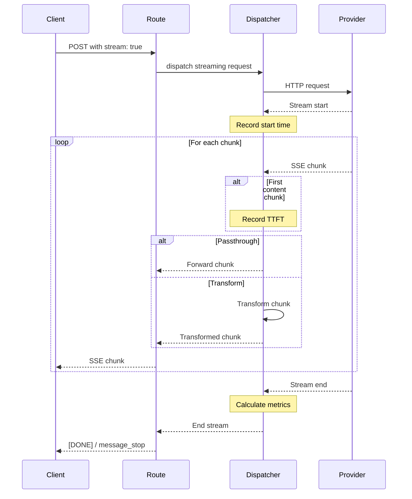
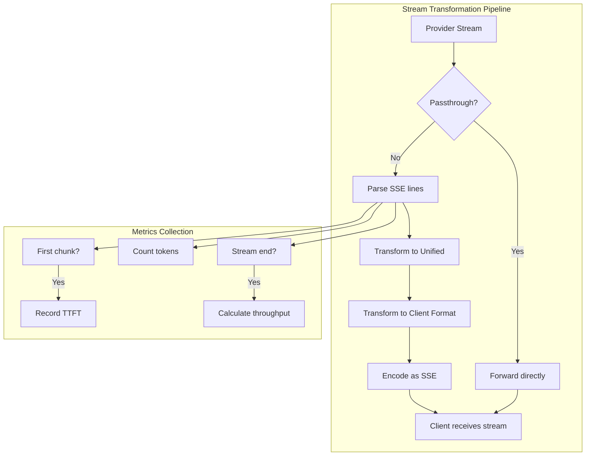

# Phase 5: Streaming Support

## Objective
Implement full Server-Sent Events (SSE) streaming support for both OpenAI and Anthropic API endpoints. This includes streaming passthrough (when formats match), streaming transformation (when formats differ), and proper stream lifecycle management with metrics collection.

---

## Success Criteria
- [ ] Streaming requests (`stream: true`) return SSE responses
- [ ] OpenAI streaming format works for `/v1/chat/completions`
- [ ] Anthropic streaming format works for `/v1/messages`
- [ ] Cross-format streaming transformation works (e.g., Anthropic client → OpenAI provider)
- [ ] Time-to-First-Token (TTFT) is measured and logged
- [ ] Tokens-per-second throughput is calculated
- [ ] Stream termination is handled correctly (`[DONE]` marker)
- [ ] Usage information is extracted from stream completion events
- [ ] Streaming errors are propagated correctly to clients

---

## Deliverables

### 1. New/Modified Files
```
packages/backend/src/
├── routes/
│   ├── chat-completions.ts        # MODIFIED: Add streaming support
│   └── messages.ts                # MODIFIED: Add streaming support
├── services/
│   ├── dispatcher.ts              # MODIFIED: Handle streaming responses
│   ├── stream-handler.ts          # NEW: Stream processing utilities
│   └── stream-transformer.ts      # NEW: SSE format transformation
├── transformers/
│   ├── openai.ts                  # MODIFIED: Add streaming methods
│   └── anthropic.ts               # MODIFIED: Add streaming methods
├── types/
│   ├── streaming.ts               # NEW: Streaming type definitions
│   ├── openai.ts                  # MODIFIED: Add chunk types
│   └── anthropic.ts               # MODIFIED: Add event types
└── tests/
    ├── streaming.test.ts          # NEW: Streaming tests
    └── stream-transform.test.ts   # NEW: Stream transformation tests
```

### 2. Type Definitions

```typescript
// packages/backend/src/types/streaming.ts
interface StreamMetrics {
  ttft: number | null;           // Time to first token (ms)
  tokensPerSecond: number | null;
  totalTokens: number;
  streamDuration: number;        // Total stream time (ms)
}

interface StreamContext {
  requestId: string;
  startTime: number;
  firstTokenTime: number | null;
  tokenCount: number;
  clientFormat: ApiType;         // Format to send to client
  providerFormat: ApiType;       // Format received from provider
  passthrough: boolean;          // Skip transformation?
}

interface StreamChunk {
  raw: string;                   // Raw SSE line
  parsed: unknown;               // Parsed JSON data
  isEnd: boolean;                // Is this the [DONE] marker?
  hasContent: boolean;           // Does this chunk have output content?
}
```

```typescript
// packages/backend/src/types/openai.ts (additions)
interface OpenAIChatCompletionChunk {
  id: string;
  object: "chat.completion.chunk";
  created: number;
  model: string;
  choices: OpenAIStreamChoice[];
  usage?: OpenAIUsage;          // Present in final chunk if requested
}

interface OpenAIStreamChoice {
  index: number;
  delta: OpenAIDelta;
  finish_reason: string | null;
}

interface OpenAIDelta {
  role?: "assistant";
  content?: string;
  tool_calls?: OpenAIToolCallDelta[];
}

interface OpenAIToolCallDelta {
  index: number;
  id?: string;
  type?: "function";
  function?: {
    name?: string;
    arguments?: string;
  };
}
```

```typescript
// packages/backend/src/types/anthropic.ts (additions)
type AnthropicStreamEvent = 
  | MessageStartEvent
  | ContentBlockStartEvent
  | ContentBlockDeltaEvent
  | ContentBlockStopEvent
  | MessageDeltaEvent
  | MessageStopEvent
  | PingEvent
  | ErrorEvent;

interface MessageStartEvent {
  type: "message_start";
  message: Partial<AnthropicMessagesResponse>;
}

interface ContentBlockDeltaEvent {
  type: "content_block_delta";
  index: number;
  delta: {
    type: "text_delta" | "input_json_delta";
    text?: string;
    partial_json?: string;
  };
}

interface MessageDeltaEvent {
  type: "message_delta";
  delta: {
    stop_reason: string;
    stop_sequence?: string;
  };
  usage: {
    output_tokens: number;
  };
}
```

---

## Implementation Tasks

### Stream Handler Service
- [ ] Create `stream-handler.ts` for SSE processing
- [ ] Implement SSE line parser:
  - Handle `data: ` prefix
  - Handle multi-line data
  - Handle `event: ` lines for Anthropic format
  - Detect `[DONE]` marker (OpenAI) and message_stop (Anthropic)
- [ ] Create `ReadableStream` wrapper for transformation
- [ ] Track stream metrics (TTFT, token count, throughput)
- [ ] Implement proper stream cleanup on abort/error

### Stream Transformer Service
- [ ] Create `stream-transformer.ts` for format conversion
- [ ] Implement OpenAI chunk → Unified chunk conversion
- [ ] Implement Anthropic event → Unified chunk conversion
- [ ] Implement Unified chunk → OpenAI chunk conversion
- [ ] Implement Unified chunk → Anthropic event conversion
- [ ] Handle tool call streaming deltas
- [ ] Accumulate usage from stream events

### OpenAI Streaming
- [ ] Modify OpenAI transformer for streaming:
  - `transformStreamChunkOut`: OpenAI chunk → Unified
  - `transformStreamChunkIn`: Unified → OpenAI chunk
- [ ] Handle `stream_options.include_usage` parameter
- [ ] Generate proper chunk IDs (consistent across stream)
- [ ] Handle `finish_reason` in final chunk

### Anthropic Streaming
- [ ] Modify Anthropic transformer for streaming:
  - `transformStreamEventOut`: Anthropic event → Unified
  - `transformStreamEventIn`: Unified → Anthropic event
- [ ] Generate all required Anthropic events:
  - `message_start` at beginning
  - `content_block_start` for each content block
  - `content_block_delta` for content
  - `content_block_stop` for block completion
  - `message_delta` with stop reason
  - `message_stop` at end
- [ ] Handle `ping` events (passthrough or generate)
- [ ] Extract usage from `message_delta` event

### Route Handler Updates
- [ ] Modify `/v1/chat/completions` for streaming:
  - Set `Content-Type: text/event-stream`
  - Set `Cache-Control: no-cache`
  - Set `Connection: keep-alive`
  - Return `ReadableStream` response
- [ ] Modify `/v1/messages` with same headers
- [ ] Handle client abort (close stream gracefully)

### Dispatcher Streaming Path
- [ ] Detect `stream: true` in request
- [ ] Create streaming response pipeline:
  1. Provider returns ReadableStream
  2. Wrap in transformation stream (if needed)
  3. Track metrics during streaming
  4. Return transformed stream to client
- [ ] Implement passthrough streaming (no transformation)
- [ ] Handle streaming errors mid-stream

### Metrics Collection
- [ ] Capture TTFT when first content chunk arrives
- [ ] Count tokens as they stream
- [ ] Calculate tokens/second on stream completion
- [ ] Log metrics after stream ends

---

## Architecture Diagram





---

## SSE Format Reference

### OpenAI Streaming Format
```
data: {"id":"chatcmpl-123","object":"chat.completion.chunk","created":1694268190,"model":"gpt-4o","choices":[{"index":0,"delta":{"role":"assistant"},"finish_reason":null}]}

data: {"id":"chatcmpl-123","object":"chat.completion.chunk","created":1694268190,"model":"gpt-4o","choices":[{"index":0,"delta":{"content":"Hello"},"finish_reason":null}]}

data: {"id":"chatcmpl-123","object":"chat.completion.chunk","created":1694268190,"model":"gpt-4o","choices":[{"index":0,"delta":{"content":"!"},"finish_reason":null}]}

data: {"id":"chatcmpl-123","object":"chat.completion.chunk","created":1694268190,"model":"gpt-4o","choices":[{"index":0,"delta":{},"finish_reason":"stop"}]}

data: [DONE]
```

### Anthropic Streaming Format
```
event: message_start
data: {"type":"message_start","message":{"id":"msg_123","type":"message","role":"assistant","content":[],"model":"claude-sonnet-4-20250514","stop_reason":null,"usage":{"input_tokens":25,"output_tokens":1}}}

event: content_block_start
data: {"type":"content_block_start","index":0,"content_block":{"type":"text","text":""}}

event: content_block_delta
data: {"type":"content_block_delta","index":0,"delta":{"type":"text_delta","text":"Hello"}}

event: content_block_delta
data: {"type":"content_block_delta","index":0,"delta":{"type":"text_delta","text":"!"}}

event: content_block_stop
data: {"type":"content_block_stop","index":0}

event: message_delta
data: {"type":"message_delta","delta":{"stop_reason":"end_turn"},"usage":{"output_tokens":10}}

event: message_stop
data: {"type":"message_stop"}
```

---

## Test Scenarios

### Basic Streaming Tests
| Test Case | Request | Expected Behavior |
|-----------|---------|-------------------|
| OpenAI stream | chat/completions, stream:true | Multiple SSE chunks, ends with [DONE] |
| Anthropic stream | messages, stream:true | Event sequence, ends with message_stop |
| Stream disabled | stream:false or missing | Single JSON response |

### Passthrough Streaming Tests
| Test Case | Client | Provider | Expected |
|-----------|--------|----------|----------|
| OpenAI → OpenAI | chat API | OpenAI provider | Direct passthrough |
| Anthropic → Anthropic | messages API | Anthropic provider | Direct passthrough |

### Transformation Streaming Tests
| Test Case | Client | Provider | Verification |
|-----------|--------|----------|--------------|
| Anthropic → OpenAI | messages API | OpenAI provider | Anthropic events generated from OpenAI chunks |
| OpenAI → Anthropic | chat API | Anthropic provider | OpenAI chunks generated from Anthropic events |

### Tool Call Streaming Tests
| Test Case | Provider Response | Expected Client Format |
|-----------|-------------------|------------------------|
| OpenAI tool call | Tool call deltas | Proper tool_calls in chunks |
| Transform to Anthropic | OpenAI tool call | tool_use content block events |
| Transform to OpenAI | Anthropic tool_use | OpenAI tool_calls deltas |

### Metrics Tests
| Test Case | Verification |
|-----------|--------------|
| TTFT captured | TTFT > 0 after first content |
| Token count | Matches accumulated content |
| Throughput | tokens / duration is reasonable |

### Error Handling Tests
| Test Case | Scenario | Expected |
|-----------|----------|----------|
| Provider stream error | 500 during stream | Error event to client |
| Client abort | Client closes connection | Stream cleanup |
| Timeout | No data for timeout period | Timeout error |

---

## Verification Steps

```bash
# 1. Start server
bun run dev

# 2. Test OpenAI streaming
curl -N -X POST http://localhost:4000/v1/chat/completions \
  -H "Authorization: Bearer test-key" \
  -H "Content-Type: application/json" \
  -d '{
    "model": "fast",
    "stream": true,
    "messages": [{"role": "user", "content": "Count to 5"}]
  }'
# Expected: SSE chunks ending with [DONE]

# 3. Test Anthropic streaming
curl -N -X POST http://localhost:4000/v1/messages \
  -H "x-api-key: test-key" \
  -H "Content-Type: application/json" \
  -d '{
    "model": "sonnet",
    "max_tokens": 100,
    "stream": true,
    "messages": [{"role": "user", "content": "Count to 5"}]
  }'
# Expected: Anthropic event stream ending with message_stop

# 4. Test cross-format streaming (Anthropic client → OpenAI provider)
curl -N -X POST http://localhost:4000/v1/messages \
  -H "x-api-key: test-key" \
  -H "Content-Type: application/json" \
  -d '{
    "model": "fast",
    "max_tokens": 100,
    "stream": true,
    "messages": [{"role": "user", "content": "Say hello"}]
  }'
# Expected: Anthropic events generated from OpenAI provider

# 5. Test abort handling
timeout 2 curl -N -X POST http://localhost:4000/v1/chat/completions \
  -H "Authorization: Bearer test-key" \
  -H "Content-Type: application/json" \
  -d '{
    "model": "smart",
    "stream": true,
    "messages": [{"role": "user", "content": "Write a long story"}]
  }'
# Expected: Clean abort, no server errors

# 6. Run unit tests
bun test
```

---

## Notes & Decisions

### TransformStream vs Manual Chunking
Using `TransformStream` API for streaming transformation because:
- Native Bun/Web API support
- Backpressure handling built-in
- Clean composition of transformation stages
- Memory efficient for large streams

### TTFT Measurement
- Measured from request sent to first **content** chunk
- Initial role/setup chunks don't count
- Critical metric for perceived latency

### Token Counting in Streams
- Use provider's token count from final event when available
- Fall back to estimated count from content length
- Accurate counts require final usage event

### Stream Timeout Strategy
- Different from request timeout
- Allow longer streams (no content timeout)
- Implement heartbeat/ping detection for stalled streams
- Default: 30 seconds without data = timeout

### Error Mid-Stream
When errors occur during streaming:
- OpenAI: Send error as final chunk before [DONE]
- Anthropic: Send error event type
- Log error with request context
- Close stream gracefully

---

## Dependencies on Other Phases
- **Phase 1**: Logging infrastructure
- **Phase 2**: Provider client, route handling
- **Phase 3**: Router (for provider selection)
- **Phase 4**: Transformation foundation (non-streaming)

## Phases That Depend on This
- **Phase 6**: Cooldown triggers on streaming errors
- **Phase 7**: Streaming metrics in observability
- **Phase 8**: Real-time event stream uses SSE
