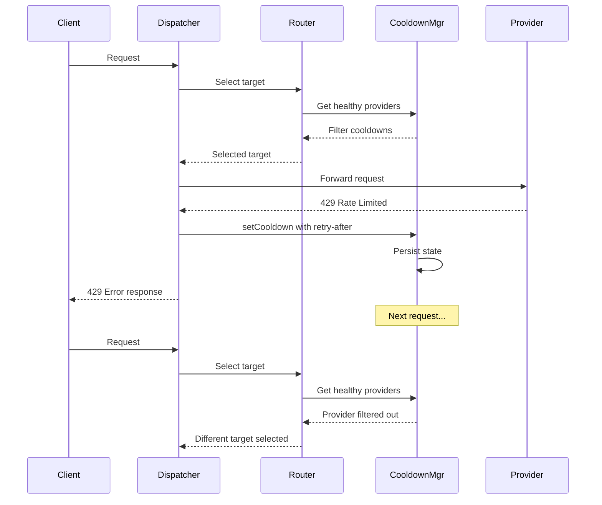

# Phase 6: Resilience & Health Management

## Objective
Implement the cooldown system and provider health management that automatically handles provider errors, rate limits, and outages. This phase ensures Plexus gracefully degrades when providers experience issues, automatically routing around unhealthy targets and recovering when providers become available again.

---

## Success Criteria
- [ ] Providers experiencing errors are placed on cooldown automatically
- [ ] Different error types trigger appropriate cooldown durations
- [ ] Cooldown state persists across server restarts
- [ ] Router filters out providers on cooldown before selection
- [ ] Health status is exposed via API endpoint
- [ ] Manual cooldown clearing is supported
- [ ] `retry-after` headers from providers are respected
- [ ] System health indicator shows degraded state when providers are down

---

## Deliverables

### 1. New/Modified Files
```
packages/backend/src/
├── services/
│   ├── cooldown-manager.ts        # NEW: Cooldown state management
│   ├── health-monitor.ts          # NEW: System health tracking
│   ├── router.ts                  # MODIFIED: Filter unhealthy providers
│   ├── dispatcher.ts              # MODIFIED: Trigger cooldowns on errors
│   └── provider-client.ts         # MODIFIED: Parse retry-after headers
├── routes/
│   └── health.ts                  # MODIFIED: Add detailed health status
├── types/
│   └── health.ts                  # NEW: Health type definitions
├── storage/
│   └── cooldown-store.ts          # NEW: Persistent cooldown storage
└── tests/
    ├── cooldown.test.ts           # NEW: Cooldown logic tests
    └── health.test.ts             # NEW: Health endpoint tests
```

### 2. Extended Configuration Schema
```yaml
# config/plexus.yaml
server:
  port: 4000
  host: "0.0.0.0"

logging:
  level: "info"

# NEW: Resilience configuration
resilience:
  cooldown:
    # Default cooldown durations by error type (seconds)
    defaults:
      rate_limit: 60           # 429 errors
      auth_error: 3600         # 401/403 errors (likely config issue)
      timeout: 30              # Request timeout
      server_error: 120        # 5xx errors
      connection_error: 60     # Network failures
    
    # Maximum cooldown duration (cap for retry-after)
    maxDuration: 3600          # 1 hour max
    
    # Minimum cooldown duration
    minDuration: 5             # At least 5 seconds
    
    # Persistent storage path
    storagePath: "./data/cooldowns.json"
  
  # Health check configuration
  health:
    degradedThreshold: 0.5     # 50% of providers down = degraded
    unhealthyThreshold: 0.9    # 90% of providers down = unhealthy

providers:
  - name: "openai"
    enabled: true
    # ... provider config ...
    
    # NEW: Provider-specific cooldown overrides
    cooldown:
      rate_limit: 30           # OpenAI has good rate limit recovery
      server_error: 180
```

### 3. Type Definitions

```typescript
// packages/backend/src/types/health.ts
type CooldownReason = 
  | "rate_limit"       // 429
  | "auth_error"       // 401, 403
  | "timeout"          // Request timeout
  | "server_error"     // 5xx
  | "connection_error" // Network failure
  | "manual";          // Manually set

interface CooldownEntry {
  provider: string;
  reason: CooldownReason;
  startTime: number;       // Unix timestamp ms
  endTime: number;         // Unix timestamp ms
  httpStatus?: number;     // Original HTTP status
  message?: string;        // Error message
  retryAfter?: number;     // From provider header
}

interface CooldownState {
  entries: Map<string, CooldownEntry>;
  lastUpdated: number;
}

type SystemHealthStatus = "healthy" | "degraded" | "unhealthy";

interface ProviderHealth {
  name: string;
  enabled: boolean;
  onCooldown: boolean;
  cooldownEntry?: CooldownEntry;
  cooldownRemaining?: number;    // Seconds remaining
}

interface SystemHealth {
  status: SystemHealthStatus;
  timestamp: string;
  providers: ProviderHealth[];
  summary: {
    total: number;
    healthy: number;
    onCooldown: number;
    disabled: number;
  };
}

interface HealthCheckResponse {
  status: "ok" | "degraded" | "unhealthy";
  timestamp: string;
  version: string;
  system: SystemHealth;
}
```

---

## Implementation Tasks

### Cooldown Manager Service
- [ ] Create `cooldown-manager.ts` service
- [ ] Implement cooldown state storage (in-memory + persistent)
- [ ] Methods:
  - `setCooldown(provider, reason, duration?, httpStatus?, message?)`: Add provider to cooldown
  - `getCooldown(provider)`: Get cooldown entry if on cooldown
  - `isOnCooldown(provider)`: Boolean check
  - `clearCooldown(provider)`: Remove from cooldown
  - `clearAllCooldowns()`: Clear all cooldowns
  - `getActiveCooldowns()`: List all active cooldowns
  - `getRemainingTime(provider)`: Seconds until cooldown expires
- [ ] Automatic expiration of cooldowns (lazy evaluation)
- [ ] Calculate cooldown duration based on:
  1. Provider-specific override
  2. `retry-after` header from error response
  3. Default duration for error type

### Cooldown Storage
- [ ] Create `cooldown-store.ts` for persistence
- [ ] Save cooldown state to JSON file
- [ ] Load cooldown state on startup
- [ ] Handle missing/corrupted file gracefully
- [ ] Atomic writes to prevent corruption
- [ ] Configurable storage path

### Retry-After Parsing
- [ ] Modify `provider-client.ts` to extract retry-after
- [ ] Parse formats:
  - Seconds: `retry-after: 60`
  - HTTP date: `retry-after: Wed, 21 Oct 2024 07:28:00 GMT`
- [ ] Extract from error response body (providers vary):
  - OpenAI: `error.message` may contain duration
  - Anthropic: `error.message` may contain timing
- [ ] Cap at `maxDuration` from config

### Dispatcher Integration
- [ ] Modify `dispatcher.ts` to handle provider errors
- [ ] On error response:
  1. Determine error type from HTTP status
  2. Extract retry-after if present
  3. Call cooldown manager to set cooldown
  4. Log cooldown activation
- [ ] Error type mapping:
  | HTTP Status | Cooldown Reason |
  |-------------|-----------------|
  | 429 | rate_limit |
  | 401, 403 | auth_error |
  | 408 | timeout |
  | 500-599 | server_error |
  | Network error | connection_error |

### Router Health Filtering
- [ ] Modify `router.ts` to filter unhealthy providers
- [ ] Before target selection:
  1. Get all targets for alias
  2. Filter out providers on cooldown
  3. If no healthy targets remain, return error
- [ ] Error should indicate all providers on cooldown
- [ ] Log filtering decisions at debug level

### Health Monitor Service
- [ ] Create `health-monitor.ts` service
- [ ] Calculate system health status:
  - `healthy`: All enabled providers available
  - `degraded`: Some providers on cooldown (< threshold)
  - `unhealthy`: Most providers on cooldown (>= threshold)
- [ ] Track provider health history (optional, for dashboards)
- [ ] Emit events on health status changes

### Health Endpoint Enhancement
- [ ] Modify `/health` endpoint for detailed response
- [ ] Add `/health/providers` endpoint for provider-specific health
- [ ] Include:
  - Overall system status
  - Per-provider status
  - Cooldown details with remaining time
  - Summary counts
- [ ] Simple `/health` returns basic status for load balancers
- [ ] Detailed `/health?detail=true` returns full health info

---

## Architecture Diagram

```mermaid
flowchart TD
    subgraph Error Flow
        A[Provider Error] --> B{Error Type?}
        B -->|429| C[rate_limit]
        B -->|401/403| D[auth_error]
        B -->|5xx| E[server_error]
        B -->|timeout| F[timeout]
        B -->|network| G[connection_error]
        
        C --> H[Parse retry-after]
        D --> H
        E --> H
        F --> H
        G --> H
        
        H --> I[Calculate Duration]
        I --> J[Set Cooldown]
        J --> K[Persist State]
    end
    
    subgraph Request Flow
        L[Incoming Request] --> M[Router]
        M --> N{Filter Providers}
        N --> O[Check Cooldowns]
        O --> P{Any Healthy?}
        P -->|Yes| Q[Select Target]
        P -->|No| R[503 All Providers Unavailable]
        Q --> S[Execute Request]
    end
    
    subgraph Health Monitoring
        T[Cooldown Manager] --> U[Health Monitor]
        U --> V{Calculate Status}
        V --> W[healthy / degraded / unhealthy]
        W --> X[/health endpoint]
    end
```



---

## Test Scenarios

### Cooldown Activation Tests
| Test Case | Error | Expected Cooldown |
|-----------|-------|-------------------|
| Rate limit | 429 | 60s (or retry-after) |
| Auth error | 401 | 3600s |
| Server error | 500 | 120s |
| Timeout | Request timeout | 30s |
| Network error | Connection refused | 60s |

### Retry-After Parsing Tests
| Test Case | Header Value | Expected Duration |
|-----------|--------------|-------------------|
| Seconds | `60` | 60 |
| Large seconds | `7200` | 3600 (capped) |
| HTTP date | `Wed, 21 Oct 2024 07:28:00 GMT` | Calculated diff |
| Missing | No header | Default for type |
| Invalid | `invalid` | Default for type |

### Router Filtering Tests
| Test Case | Provider State | Expected Behavior |
|-----------|----------------|-------------------|
| All healthy | None on cooldown | Normal selection |
| One on cooldown | 1 of 2 on cooldown | Routes to healthy |
| All on cooldown | All on cooldown | 503 error |
| Cooldown expired | Just past end_time | Provider available |

### Persistence Tests
| Test Case | Scenario | Expected |
|-----------|----------|----------|
| Save state | Set cooldown | File updated |
| Load on start | Restart server | Cooldowns restored |
| Cleanup expired | Restart with expired | Expired removed |
| Corrupted file | Invalid JSON | Start fresh |

### Health Endpoint Tests
| Test Case | Provider State | Expected Status |
|-----------|----------------|-----------------|
| All healthy | 0 on cooldown | healthy |
| Some down | 40% on cooldown | healthy |
| Degraded | 60% on cooldown | degraded |
| Unhealthy | 95% on cooldown | unhealthy |

---

## API Responses

### GET /health
```json
{
  "status": "ok",
  "timestamp": "2024-01-15T10:30:00.000Z",
  "version": "0.1.0"
}
```

### GET /health?detail=true
```json
{
  "status": "degraded",
  "timestamp": "2024-01-15T10:30:00.000Z",
  "version": "0.1.0",
  "system": {
    "status": "degraded",
    "timestamp": "2024-01-15T10:30:00.000Z",
    "providers": [
      {
        "name": "openai",
        "enabled": true,
        "onCooldown": true,
        "cooldownEntry": {
          "provider": "openai",
          "reason": "rate_limit",
          "startTime": 1705315200000,
          "endTime": 1705315260000,
          "httpStatus": 429,
          "message": "Rate limit exceeded",
          "retryAfter": 60
        },
        "cooldownRemaining": 45
      },
      {
        "name": "anthropic",
        "enabled": true,
        "onCooldown": false
      }
    ],
    "summary": {
      "total": 2,
      "healthy": 1,
      "onCooldown": 1,
      "disabled": 0
    }
  }
}
```

---

## Verification Steps

```bash
# 1. Start server
bun run dev

# 2. Trigger a rate limit (mock or real)
# Option A: Use a test endpoint to simulate
curl -X POST http://localhost:4000/test/cooldown/openai?reason=rate_limit

# Option B: Actually hit rate limit (not recommended)
for i in {1..100}; do
  curl -X POST http://localhost:4000/v1/chat/completions \
    -H "Authorization: Bearer test-key" \
    -H "Content-Type: application/json" \
    -d '{"model": "fast", "messages": [{"role": "user", "content": "Hi"}]}'
done

# 3. Check health endpoint
curl http://localhost:4000/health?detail=true
# Expected: Shows provider on cooldown

# 4. Verify routing avoidance
curl -X POST http://localhost:4000/v1/chat/completions \
  -H "Authorization: Bearer test-key" \
  -H "Content-Type: application/json" \
  -d '{"model": "smart", "messages": [{"role": "user", "content": "Hi"}]}'
# Expected: Routes to non-cooldown provider

# 5. Clear cooldown manually
curl -X POST http://localhost:4000/admin/cooldowns/clear/openai \
  -H "Authorization: Bearer admin-key"

# 6. Verify recovery
curl http://localhost:4000/health?detail=true
# Expected: Provider no longer on cooldown

# 7. Test persistence - restart server
# Kill and restart server
bun run dev

# 8. Check cooldowns survived restart
curl http://localhost:4000/health?detail=true
# Expected: Previously set cooldowns still active (if not expired)

# 9. Run tests
bun test
```

---

## Notes & Decisions

### Lazy vs Eager Cooldown Expiration
Using lazy evaluation (check on access) because:
- No background timers needed
- Simpler implementation
- Works correctly with server restarts
- Storage doesn't need continuous updates

### Cooldown Granularity
Cooldowns are per-provider, not per-model, because:
- Rate limits usually apply at account/API key level
- Server errors affect all models on that provider
- Simpler state management
- Can extend to per-model in future if needed

### All Providers on Cooldown Behavior
When all providers for an alias are on cooldown:
- Return 503 Service Unavailable
- Include cooldown information in error
- Include estimated recovery time
- Do not attempt to call any provider

### Auth Errors Are Long Cooldowns
Authentication errors (401/403) get long cooldowns because:
- Usually indicate configuration problems
- Require human intervention
- Rapid retries won't fix the issue
- Protection against burning through quotas

---

## Dependencies on Other Phases
- **Phase 1**: Configuration, logging, storage utilities
- **Phase 2**: Provider client, error response handling
- **Phase 3**: Router integration
- **Phase 5**: Streaming error handling

## Phases That Depend on This
- **Phase 7**: Cooldown events in observability
- **Phase 8**: Cooldown management in admin API
