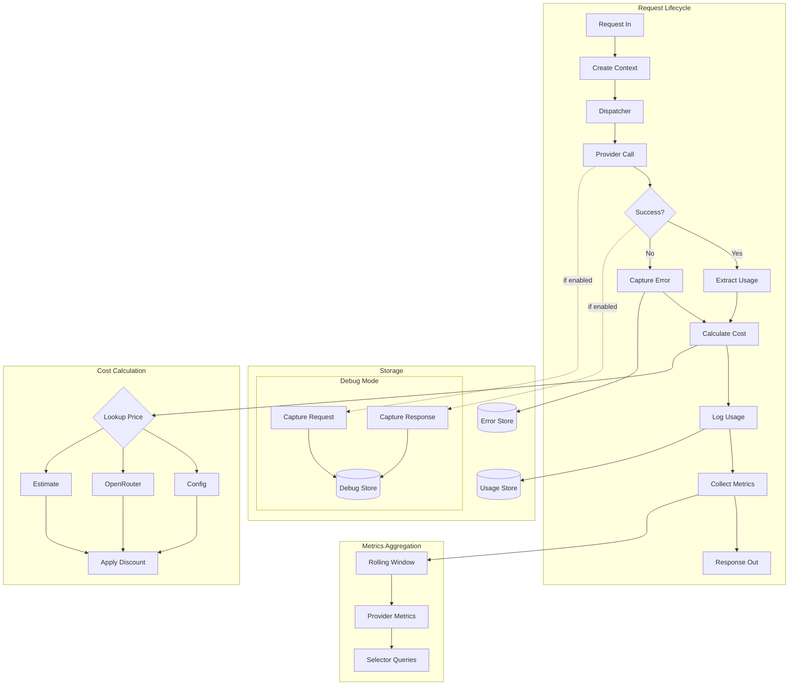
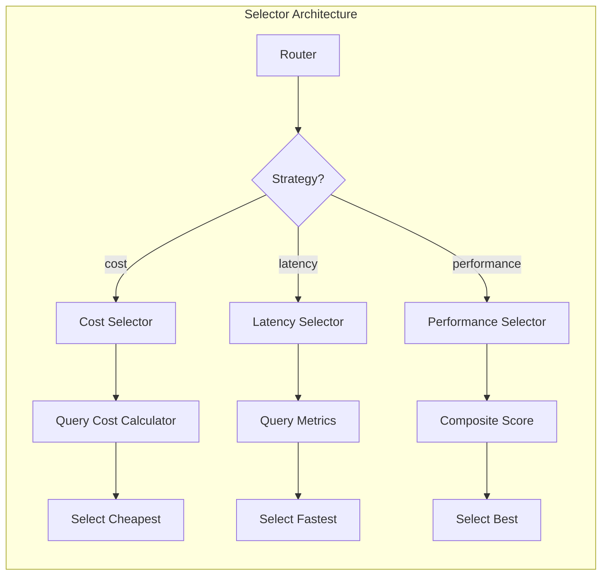

# Phase 7: Observability & Logging

## Objective
Implement comprehensive request logging, usage tracking, cost calculation, and performance metrics. This phase provides visibility into system behavior, enables billing/chargeback, and supplies the data needed for cost-based and latency-based routing selectors.

---

## Success Criteria
- [ ] Every request is logged with detailed metadata
- [ ] Token usage is tracked (input, output, cached, reasoning)
- [ ] Cost is calculated based on pricing configuration
- [ ] Request logs are persisted to queryable storage
- [ ] Debug mode captures full request/response payloads
- [ ] Performance metrics (TTFT, throughput, duration) are recorded
- [ ] Error logs are captured separately for debugging
- [ ] Cost-based and latency-based selectors are functional

---

## Deliverables

### 1. New/Modified Files
```
packages/backend/src/
├── services/
│   ├── usage-logger.ts            # NEW: Request/usage logging
│   ├── cost-calculator.ts         # NEW: Pricing and cost computation
│   ├── metrics-collector.ts       # NEW: Performance metrics aggregation
│   ├── selector.ts                # MODIFIED: Add cost/latency selectors
│   └── dispatcher.ts              # MODIFIED: Integrate logging
├── storage/
│   ├── usage-store.ts             # NEW: Usage log persistence
│   └── error-store.ts             # NEW: Error log persistence
├── types/
│   ├── usage.ts                   # NEW: Usage log type definitions
│   ├── pricing.ts                 # NEW: Pricing configuration types
│   └── metrics.ts                 # NEW: Metrics type definitions
└── tests/
    ├── usage-logger.test.ts       # NEW: Logging tests
    ├── cost-calculator.test.ts    # NEW: Cost calculation tests
    └── selectors.test.ts          # MODIFIED: Cost/latency selector tests
```

### 2. Extended Configuration Schema
```yaml
# config/plexus.yaml

# Logging configuration
logging:
  level: "info"
  
  # NEW: Usage logging settings
  usage:
    enabled: true
    storagePath: "./data/logs/usage"
    retentionDays: 30
    
  # NEW: Debug mode settings  
  debug:
    enabled: false              # Enable detailed capture
    captureRequests: true       # Log full request bodies
    captureResponses: true      # Log full response bodies
    storagePath: "./data/logs/debug"
    retentionDays: 7

  # NEW: Error logging
  errors:
    storagePath: "./data/logs/errors"
    retentionDays: 90

# NEW: Pricing configuration
pricing:
  # Simple per-model pricing
  models:
    "gpt-4o":
      inputPer1M: 2.50
      outputPer1M: 10.00
      cachedPer1M: 1.25
      
    "gpt-4o-mini":
      inputPer1M: 0.15
      outputPer1M: 0.60
      cachedPer1M: 0.075
      
    "claude-sonnet-4-20250514":
      inputPer1M: 3.00
      outputPer1M: 15.00
      cachedPer1M: 0.30
      
    "claude-3-5-haiku-20241022":
      inputPer1M: 0.80
      outputPer1M: 4.00
      cachedPer1M: 0.08

  # Range-based pricing (volume tiers)
  tiered:
    "gpt-4-turbo":
      - maxInputTokens: 128000
        inputPer1M: 10.00
        outputPer1M: 30.00

  # OpenRouter dynamic pricing
  openrouter:
    enabled: false
    cacheRefreshMinutes: 60

  # Provider discount factors
  discounts:
    "azure-openai": 0.85       # 15% discount

# Provider-specific additions
providers:
  - name: "openai"
    # ... existing config ...
    
    # NEW: Provider-level discount
    discount: 1.0              # No discount (multiplier)
```

### 3. Type Definitions

```typescript
// packages/backend/src/types/usage.ts
interface UsageLogEntry {
  id: string;                    // Unique request ID
  timestamp: string;             // ISO timestamp
  
  // Request info
  clientIp: string;
  apiKey: string;                // Key name (not secret)
  apiType: ApiType;              // Incoming API format
  
  // Routing info
  aliasUsed: string;             // Requested model/alias
  actualProvider: string;        // Resolved provider
  actualModel: string;           // Resolved model
  targetApiType: ApiType;        // Provider's API format
  passthrough: boolean;          // Was transformation skipped?
  
  // Token usage
  usage: {
    inputTokens: number;
    outputTokens: number;
    cachedTokens: number;
    reasoningTokens: number;
    totalTokens: number;
  };
  
  // Cost breakdown
  cost: {
    inputCost: number;
    outputCost: number;
    cachedCost: number;
    totalCost: number;
    currency: "USD";
    source: "config" | "openrouter" | "estimated";
  };
  
  // Performance metrics
  metrics: {
    durationMs: number;
    ttftMs: number | null;       // Time to first token (streaming)
    tokensPerSecond: number | null;
  };
  
  // Status
  success: boolean;
  streaming: boolean;
  errorType?: string;
  errorMessage?: string;
}

interface UsageQuery {
  startDate?: string;
  endDate?: string;
  provider?: string;
  model?: string;
  apiKey?: string;
  success?: boolean;
  limit?: number;
  offset?: number;
}

interface UsageSummary {
  period: {
    start: string;
    end: string;
  };
  requests: {
    total: number;
    successful: number;
    failed: number;
  };
  tokens: {
    input: number;
    output: number;
    cached: number;
    reasoning: number;
    total: number;
  };
  cost: {
    total: number;
    byProvider: Record<string, number>;
    byModel: Record<string, number>;
  };
  performance: {
    avgDuration: number;
    avgTtft: number;
    p50Duration: number;
    p95Duration: number;
  };
}
```

```typescript
// packages/backend/src/types/pricing.ts
interface SimplePricing {
  inputPer1M: number;
  outputPer1M: number;
  cachedPer1M?: number;
  reasoningPer1M?: number;
}

interface TieredPricing {
  maxInputTokens: number;
  inputPer1M: number;
  outputPer1M: number;
  cachedPer1M?: number;
}

interface PricingConfig {
  models: Record<string, SimplePricing>;
  tiered?: Record<string, TieredPricing[]>;
  openrouter?: {
    enabled: boolean;
    cacheRefreshMinutes: number;
  };
  discounts?: Record<string, number>;
}

interface PriceLookup {
  model: string;
  provider: string;
  inputTokens: number;
  outputTokens: number;
  cachedTokens?: number;
  reasoningTokens?: number;
}

interface CostResult {
  inputCost: number;
  outputCost: number;
  cachedCost: number;
  reasoningCost: number;
  totalCost: number;
  source: "config" | "openrouter" | "estimated";
  discount: number;
}
```

```typescript
// packages/backend/src/types/metrics.ts
interface ProviderMetrics {
  provider: string;
  period: {
    start: number;
    end: number;
  };
  requests: number;
  successRate: number;
  avgLatency: number;
  p50Latency: number;
  p95Latency: number;
  avgTtft: number;
  avgThroughput: number;    // tokens/second
  avgCostPer1K: number;     // cost per 1K tokens
}

interface MetricsWindow {
  windowMinutes: number;
  providers: Map<string, ProviderMetrics>;
}
```

---

## Implementation Tasks

### Usage Logger Service
- [ ] Create `usage-logger.ts` service
- [ ] Build usage log entry from request context:
  - Extract client IP from request
  - Get API key name from auth context
  - Get routing info from dispatcher context
  - Extract usage from response
  - Calculate cost
  - Record performance metrics
- [ ] Methods:
  - `logUsage(context, response)`: Log completed request
  - `logError(context, error)`: Log failed request
- [ ] Call at end of request lifecycle (success or error)

### Cost Calculator Service
- [ ] Create `cost-calculator.ts` service
- [ ] Load pricing config on startup
- [ ] Implement pricing lookup:
  1. Check model-specific config pricing
  2. Check tiered pricing (match input token range)
  3. Query OpenRouter API (if enabled and not found)
  4. Fall back to estimation (configurable fallback rate)
- [ ] Apply provider discount factors
- [ ] Calculate per-token-type costs
- [ ] Cache OpenRouter prices with configured TTL

### Metrics Collector Service
- [ ] Create `metrics-collector.ts` service
- [ ] Aggregate metrics in rolling time windows
- [ ] Track per-provider:
  - Request count
  - Success rate
  - Latency percentiles (p50, p95)
  - TTFT average
  - Throughput average
  - Cost per 1K tokens
- [ ] Expose methods for selector queries:
  - `getProviderLatency(provider)`: Average latency
  - `getProviderCost(provider, model)`: Cost per 1K
  - `getProviderPerformance(provider)`: Composite score
- [ ] Clean up old data outside window

### Usage Storage
- [ ] Create `usage-store.ts` for persistence
- [ ] Store logs in date-partitioned files:
  - `./data/logs/usage/2024-01-15.jsonl`
- [ ] Implement query interface:
  - Filter by date range
  - Filter by provider/model/apiKey
  - Pagination support
- [ ] Implement retention cleanup (delete old files)
- [ ] Support both JSONL and SQLite backends (future)

### Error Storage
- [ ] Create `error-store.ts` for error logs
- [ ] Store with full context:
  - Request details
  - Error type and message
  - Stack trace (if available)
  - Provider response (if any)
- [ ] Separate from usage logs for easier debugging

### Debug Mode
- [ ] Implement conditional debug capture
- [ ] When enabled, store:
  - Full request body
  - Transformed request (to provider)
  - Full response body
  - Transformed response (to client)
  - Stream snapshots (periodic during streaming)
- [ ] Link debug traces to usage log entries by ID
- [ ] Add cleanup for debug logs (shorter retention)

### Dispatcher Integration
- [ ] Modify `dispatcher.ts` for metrics collection
- [ ] Create request context at start:
  - Generate unique request ID
  - Record start time
  - Capture request metadata
- [ ] Update context through request lifecycle
- [ ] Call usage logger on completion/error
- [ ] Pass metrics to collector

### Advanced Selectors
- [ ] Implement `cost` selector in `selector.ts`:
  - Query cost calculator for each target
  - Select lowest cost target
  - Use recent metrics for dynamic costs
- [ ] Implement `latency` selector:
  - Query metrics collector for latencies
  - Select target with lowest average latency
- [ ] Implement `performance` selector:
  - Composite score: `throughput / (latency * cost)`
  - Configurable weighting factors
- [ ] Handle cold start (no metrics yet): fall back to random

---

## Architecture Diagram





---

## Test Scenarios

### Usage Logging Tests
| Test Case | Input | Expected Log Entry |
|-----------|-------|-------------------|
| Successful request | Complete request/response | Full entry with usage, cost |
| Failed request | Provider error | Entry with error details |
| Streaming request | stream: true | Entry with TTFT, throughput |
| Passthrough | No transformation | passthrough: true |

### Cost Calculation Tests
| Test Case | Model | Tokens | Expected Cost |
|-----------|-------|--------|---------------|
| Simple pricing | gpt-4o | 1000 in, 500 out | $0.0025 + $0.005 |
| With discount | azure gpt-4o | Same | Cost * 0.85 |
| Tiered pricing | gpt-4-turbo | 100K in | Tier rate applied |
| With cached | claude | 1000 cached | Cached rate |
| Unknown model | unknown | Any | Estimated rate |

### Selector Tests
| Test Case | Provider Metrics | Expected Selection |
|-----------|------------------|-------------------|
| Cost selector | A: $0.01, B: $0.02 | Provider A |
| Latency selector | A: 500ms, B: 200ms | Provider B |
| Performance | A: fast+expensive, B: slow+cheap | Composite score |
| Cold start | No metrics | Random fallback |

### Metrics Aggregation Tests
| Test Case | Input | Expected Output |
|-----------|-------|-----------------|
| First request | Single request | Metrics recorded |
| Multiple requests | 10 requests | Averages calculated |
| Window expiry | Old data | Removed from aggregation |
| Percentiles | Various latencies | p50, p95 accurate |

---

## Verification Steps

```bash
# 1. Start server with debug mode
bun run dev  # Set debug.enabled: true in config

# 2. Make a request
curl -X POST http://localhost:4000/v1/chat/completions \
  -H "Authorization: Bearer test-key" \
  -H "Content-Type: application/json" \
  -d '{"model": "fast", "messages": [{"role": "user", "content": "Hi"}]}'

# 3. Check usage logs
cat data/logs/usage/$(date +%Y-%m-%d).jsonl | jq
# Expected: Usage entry with all fields populated

# 4. Check debug logs (if enabled)
ls data/logs/debug/
cat data/logs/debug/$(date +%Y-%m-%d)/<request-id>.json | jq

# 5. Make multiple requests to populate metrics
for i in {1..20}; do
  curl -s -X POST http://localhost:4000/v1/chat/completions \
    -H "Authorization: Bearer test-key" \
    -H "Content-Type: application/json" \
    -d '{"model": "smart", "messages": [{"role": "user", "content": "Hi"}]}'
done

# 6. Test cost-based selector
# Configure alias with selector: cost
curl -X POST http://localhost:4000/v1/chat/completions \
  -H "Authorization: Bearer test-key" \
  -H "Content-Type: application/json" \
  -d '{"model": "cost-optimized", "messages": [{"role": "user", "content": "Hi"}]}'
# Verify in logs it selected cheaper provider

# 7. Test latency-based selector
curl -X POST http://localhost:4000/v1/chat/completions \
  -H "Authorization: Bearer test-key" \
  -H "Content-Type: application/json" \
  -d '{"model": "latency-optimized", "messages": [{"role": "user", "content": "Hi"}]}'
# Verify in logs it selected faster provider

# 8. Test error logging
# Trigger an error (e.g., invalid model)
curl -X POST http://localhost:4000/v1/chat/completions \
  -H "Authorization: Bearer test-key" \
  -H "Content-Type: application/json" \
  -d '{"model": "nonexistent", "messages": [{"role": "user", "content": "Hi"}]}'

# Check error logs
cat data/logs/errors/*.jsonl | jq

# 9. Run tests
bun test
```

---

## Notes & Decisions

### Storage Format Decision
Using JSONL (JSON Lines) for log storage because:
- Append-only writes are fast
- Easy to grep/process with standard tools
- No database setup required
- Can migrate to SQLite later if query needs grow

### Metrics Window Strategy
Using rolling time windows (e.g., last 5 minutes) rather than fixed periods because:
- Adapts quickly to provider changes
- Recent data is most relevant for routing
- Simpler than exponential moving averages
- Configurable window size

### Cost Source Priority
1. **Config pricing**: Most reliable, user-controlled
2. **OpenRouter API**: Good for dynamic pricing
3. **Estimation**: Last resort, conservative estimate

### Debug Mode Performance Impact
Debug mode has significant overhead:
- Full body serialization
- Additional writes
- Should be disabled in production
- Use for troubleshooting only

### Token Imputation
When providers don't report all token types:
- Input tokens: Usually reported
- Output tokens: Usually reported
- Cached tokens: May need estimation from provider hints
- Reasoning tokens: May need imputation from output

---

## Dependencies on Other Phases
- **Phase 1**: Configuration, logging infrastructure
- **Phase 2**: Dispatcher, request lifecycle
- **Phase 3**: Router, selector interface
- **Phase 4**: Transformation (track passthrough)
- **Phase 5**: Streaming metrics (TTFT, throughput)
- **Phase 6**: Health integration (cooldown triggering)

## Phases That Depend on This
- **Phase 8**: Management API queries logs and metrics
