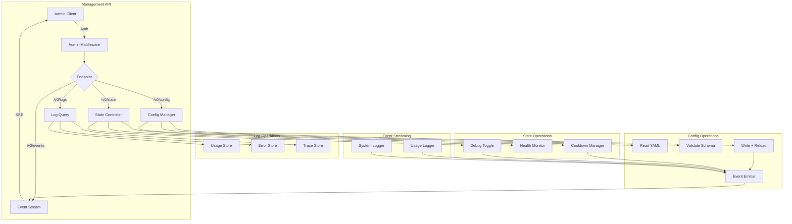
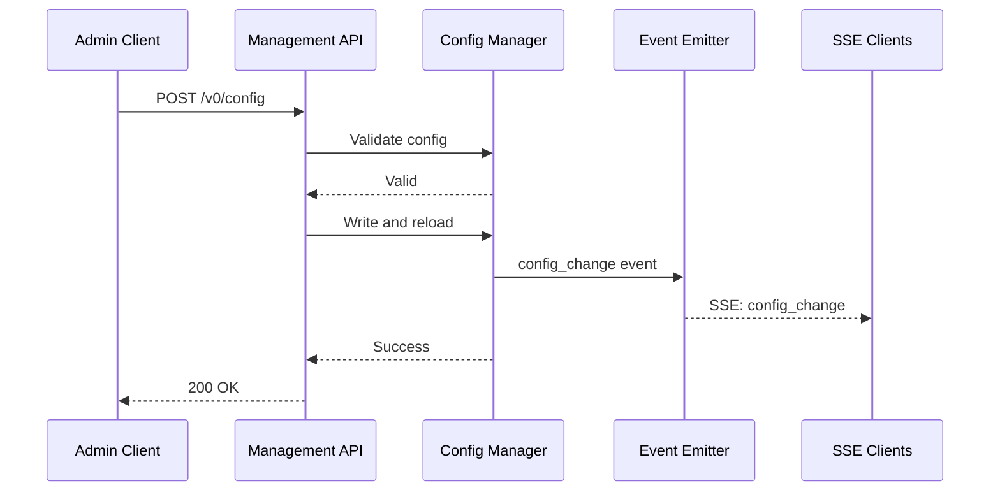

# Phase 8: Management API

## Objective
Implement the consolidated management API as specified in NEWAPI.md. This provides a clean, unified interface for configuration management, system state control, log querying, and real-time event streaming. The management API enables administrative dashboards, automation tooling, and operational oversight of the Plexus gateway.

---

## Success Criteria
- [ ] GET/POST `/v0/config` manages the YAML configuration
- [ ] GET/POST `/v0/state` provides system state and control
- [ ] GET/DELETE `/v0/logs` enables log querying and cleanup
- [ ] GET `/v0/events` provides real-time SSE event stream
- [ ] Admin authentication protects all management endpoints
- [ ] Configuration updates are validated and hot-reloaded
- [ ] All existing data from Phases 6-7 is accessible via API

---

## Deliverables

### 1. New/Modified Files
```
packages/backend/src/
├── routes/
│   ├── v0/
│   │   ├── config.ts              # NEW: /v0/config endpoints
│   │   ├── state.ts               # NEW: /v0/state endpoints
│   │   ├── logs.ts                # NEW: /v0/logs endpoints
│   │   └── events.ts              # NEW: /v0/events SSE stream
│   └── admin.ts                   # MODIFIED: Route registration
├── services/
│   ├── event-emitter.ts           # NEW: System event bus
│   ├── config-manager.ts          # NEW: Config CRUD operations
│   └── log-query.ts               # NEW: Log query service
├── middleware/
│   └── admin-auth.ts              # NEW: Admin authentication
├── types/
│   └── management.ts              # NEW: Management API types
└── tests/
    ├── config-api.test.ts         # NEW: Config endpoint tests
    ├── state-api.test.ts          # NEW: State endpoint tests
    ├── logs-api.test.ts           # NEW: Logs endpoint tests
    └── events-api.test.ts         # NEW: Events endpoint tests
```

### 2. Extended Configuration Schema
```yaml
# config/plexus.yaml

# Admin authentication
admin:
  apiKey: "${PLEXUS_ADMIN_KEY}"    # Required for /v0/* endpoints
  
  # Rate limiting for admin endpoints
  rateLimit:
    windowMs: 60000               # 1 minute
    maxRequests: 100              # Per window

# Event streaming configuration
events:
  heartbeatIntervalMs: 30000      # Keep-alive ping interval
  maxClients: 10                  # Max concurrent SSE connections
```

### 3. Type Definitions

```typescript
// packages/backend/src/types/management.ts

// === Config API Types ===
interface ConfigGetResponse {
  config: string;                 // Raw YAML content
  lastModified: string;           // ISO timestamp
  checksum: string;               // SHA-256 for change detection
}

interface ConfigUpdateRequest {
  config: string;                 // New YAML content
  validate?: boolean;             // Validate before applying (default: true)
  reload?: boolean;               // Hot reload after save (default: true)
}

interface ConfigUpdateResponse {
  success: boolean;
  message: string;
  validationErrors?: string[];
  previousChecksum: string;
  newChecksum: string;
}

// === State API Types ===
interface StateGetResponse {
  debug: {
    enabled: boolean;
    captureRequests: boolean;
    captureResponses: boolean;
  };
  cooldowns: CooldownEntry[];
  providers: {
    name: string;
    enabled: boolean;
    healthy: boolean;
    cooldownRemaining?: number;
    metrics?: {
      avgLatency: number;
      successRate: number;
      requestsLast5Min: number;
    };
  }[];
  uptime: number;                 // Seconds since start
  version: string;
}

type StateAction = 
  | { action: "set-debug"; payload: { enabled: boolean } }
  | { action: "clear-cooldowns"; payload?: { provider?: string } }
  | { action: "disable-provider"; payload: { provider: string } }
  | { action: "enable-provider"; payload: { provider: string } };

interface StateUpdateResponse {
  success: boolean;
  message: string;
  state: StateGetResponse;
}

// === Logs API Types ===
type LogType = "usage" | "error" | "trace";

interface LogsQuery {
  type?: LogType;                 // Default: usage
  limit?: number;                 // Default: 100, max: 1000
  offset?: number;                // For pagination
  provider?: string;              // Filter by provider
  model?: string;                 // Filter by model
  apiKey?: string;                // Filter by API key name
  success?: boolean;              // Filter by success status
  startDate?: string;             // ISO timestamp
  endDate?: string;               // ISO timestamp
}

interface LogsListResponse {
  type: LogType;
  total: number;
  limit: number;
  offset: number;
  hasMore: boolean;
  entries: UsageLogEntry[] | ErrorLogEntry[] | TraceLogEntry[];
}

interface LogDetailResponse {
  usage: UsageLogEntry;
  errors?: ErrorLogEntry[];
  traces?: TraceLogEntry[];       // Debug captures
}

interface LogsDeleteRequest {
  type?: LogType;                 // Delete specific type
  olderThanDays?: number;         // Delete by age
  all?: boolean;                  // Delete everything
}

interface LogsDeleteResponse {
  success: boolean;
  deleted: {
    usage: number;
    error: number;
    trace: number;
  };
}

// === Events API Types ===
type EventType = 
  | "usage"                       // Request completed
  | "syslog"                      // System log message
  | "state_change"                // Cooldown/debug change
  | "config_change";              // Configuration updated

interface SSEEvent {
  type: EventType;
  timestamp: string;
  data: unknown;
}

interface UsageEvent {
  type: "usage";
  data: {
    requestId: string;
    alias: string;
    provider: string;
    model: string;
    success: boolean;
    tokens: number;
    cost: number;
    duration: number;
  };
}

interface StateChangeEvent {
  type: "state_change";
  data: {
    change: "cooldown_set" | "cooldown_cleared" | "debug_toggled" | "provider_toggled";
    provider?: string;
    details: unknown;
  };
}

interface ConfigChangeEvent {
  type: "config_change";
  data: {
    previousChecksum: string;
    newChecksum: string;
    changedSections: string[];
  };
}
```

---

## API Specification

### 1. Configuration Endpoints

#### GET /v0/config
Retrieves the current configuration.

**Headers:**
```
Authorization: Bearer <admin-key>
```

**Response:**
```json
{
  "config": "server:\n  port: 4000\n  ...",
  "lastModified": "2024-01-15T10:30:00.000Z",
  "checksum": "sha256:abc123..."
}
```

#### POST /v0/config
Updates the configuration.

**Headers:**
```
Authorization: Bearer <admin-key>
Content-Type: application/json
```

**Request:**
```json
{
  "config": "server:\n  port: 4000\n  ...",
  "validate": true,
  "reload": true
}
```

**Response (Success):**
```json
{
  "success": true,
  "message": "Configuration updated and reloaded",
  "previousChecksum": "sha256:abc123...",
  "newChecksum": "sha256:def456..."
}
```

**Response (Validation Error):**
```json
{
  "success": false,
  "message": "Configuration validation failed",
  "validationErrors": [
    "providers[0].name is required",
    "models[0].selector must be one of: random, in_order, cost, latency"
  ]
}
```

---

### 2. State Endpoints

#### GET /v0/state
Returns current system state.

**Headers:**
```
Authorization: Bearer <admin-key>
```

**Response:**
```json
{
  "debug": {
    "enabled": false,
    "captureRequests": true,
    "captureResponses": true
  },
  "cooldowns": [
    {
      "provider": "openai",
      "reason": "rate_limit",
      "endTime": 1705315260000,
      "remaining": 45
    }
  ],
  "providers": [
    {
      "name": "openai",
      "enabled": true,
      "healthy": false,
      "cooldownRemaining": 45,
      "metrics": {
        "avgLatency": 523,
        "successRate": 0.98,
        "requestsLast5Min": 42
      }
    },
    {
      "name": "anthropic",
      "enabled": true,
      "healthy": true,
      "metrics": {
        "avgLatency": 612,
        "successRate": 1.0,
        "requestsLast5Min": 28
      }
    }
  ],
  "uptime": 3600,
  "version": "0.1.0"
}
```

#### POST /v0/state
Execute state commands.

**Headers:**
```
Authorization: Bearer <admin-key>
Content-Type: application/json
```

**Request (Toggle Debug):**
```json
{
  "action": "set-debug",
  "payload": {
    "enabled": true
  }
}
```

**Request (Clear Cooldowns):**
```json
{
  "action": "clear-cooldowns",
  "payload": {
    "provider": "openai"
  }
}
```

**Request (Clear All Cooldowns):**
```json
{
  "action": "clear-cooldowns"
}
```

**Response:**
```json
{
  "success": true,
  "message": "Cooldown cleared for openai",
  "state": { ... }
}
```

---

### 3. Logs Endpoints

#### GET /v0/logs
Query logs with filters.

**Headers:**
```
Authorization: Bearer <admin-key>
```

**Query Parameters:**
- `type`: `usage` (default), `error`, `trace`
- `limit`: Max entries (1-1000, default 100)
- `offset`: Pagination offset
- `provider`: Filter by provider name
- `model`: Filter by model/alias
- `apiKey`: Filter by API key name
- `success`: `true` or `false`
- `startDate`: ISO timestamp
- `endDate`: ISO timestamp

**Example:** `GET /v0/logs?type=usage&provider=openai&limit=50&startDate=2024-01-15T00:00:00Z`

**Response:**
```json
{
  "type": "usage",
  "total": 1523,
  "limit": 50,
  "offset": 0,
  "hasMore": true,
  "entries": [
    {
      "id": "req_abc123",
      "timestamp": "2024-01-15T10:30:00.000Z",
      "aliasUsed": "smart",
      "actualProvider": "openai",
      "actualModel": "gpt-4o",
      "usage": {
        "inputTokens": 100,
        "outputTokens": 250,
        "totalTokens": 350
      },
      "cost": {
        "totalCost": 0.0025
      },
      "metrics": {
        "durationMs": 1234
      },
      "success": true
    }
  ]
}
```

#### GET /v0/logs/:id
Get full details for a specific request.

**Response:**
```json
{
  "usage": {
    "id": "req_abc123",
    ...full usage entry...
  },
  "errors": [],
  "traces": [
    {
      "type": "request",
      "timestamp": "...",
      "payload": { ...original request... }
    },
    {
      "type": "response",
      "timestamp": "...",
      "payload": { ...response... }
    }
  ]
}
```

#### DELETE /v0/logs
Bulk delete logs.

**Request:**
```json
{
  "type": "trace",
  "olderThanDays": 7
}
```

**Response:**
```json
{
  "success": true,
  "deleted": {
    "usage": 0,
    "error": 0,
    "trace": 1234
  }
}
```

#### DELETE /v0/logs/:id
Delete a specific log entry.

---

### 4. Events Endpoint

#### GET /v0/events
Server-Sent Events stream for real-time monitoring.

**Headers:**
```
Authorization: Bearer <admin-key>
Accept: text/event-stream
```

**Response Stream:**
```
event: usage
data: {"type":"usage","timestamp":"2024-01-15T10:30:00.000Z","data":{"requestId":"req_abc","alias":"smart","provider":"openai","success":true,"tokens":350,"cost":0.0025,"duration":1234}}

event: state_change
data: {"type":"state_change","timestamp":"2024-01-15T10:30:05.000Z","data":{"change":"cooldown_set","provider":"openai","details":{"reason":"rate_limit","duration":60}}}

event: syslog
data: {"type":"syslog","timestamp":"2024-01-15T10:30:10.000Z","data":{"level":"warn","message":"High error rate detected for openai"}}

:heartbeat

event: config_change
data: {"type":"config_change","timestamp":"2024-01-15T10:31:00.000Z","data":{"previousChecksum":"sha256:abc","newChecksum":"sha256:def","changedSections":["providers","models"]}}
```

---

## Implementation Tasks

### Admin Authentication Middleware
- [ ] Create `admin-auth.ts` middleware
- [ ] Validate admin API key from config
- [ ] Return 401 for missing/invalid key
- [ ] Rate limit admin endpoints (configurable)
- [ ] Log admin access attempts

### Event Emitter Service
- [ ] Create `event-emitter.ts` as central event bus
- [ ] Support event types: usage, syslog, state_change, config_change
- [ ] Manage multiple SSE client connections
- [ ] Implement heartbeat/keepalive
- [ ] Clean up disconnected clients
- [ ] Limit max concurrent connections

### Config Manager Service
- [ ] Create `config-manager.ts` for config operations
- [ ] Read config file and return with checksum
- [ ] Validate config against Zod schema
- [ ] Write config atomically (temp file + rename)
- [ ] Trigger hot reload after write
- [ ] Emit config_change event
- [ ] Track last modified time

### Log Query Service
- [ ] Create `log-query.ts` for log operations
- [ ] Query usage logs with filters
- [ ] Query error logs with filters
- [ ] Query trace/debug logs
- [ ] Get full detail by request ID (join all log types)
- [ ] Delete by criteria (type, age, specific ID)
- [ ] Calculate totals for pagination

### Route Handlers
- [ ] Implement `/v0/config` GET handler
- [ ] Implement `/v0/config` POST handler with validation
- [ ] Implement `/v0/state` GET handler
- [ ] Implement `/v0/state` POST handler with action dispatch
- [ ] Implement `/v0/logs` GET handler with query parsing
- [ ] Implement `/v0/logs/:id` GET handler
- [ ] Implement `/v0/logs` DELETE handler
- [ ] Implement `/v0/logs/:id` DELETE handler
- [ ] Implement `/v0/events` SSE handler

### Integration Points
- [ ] Wire usage logger to emit usage events
- [ ] Wire cooldown manager to emit state_change events
- [ ] Wire config loader to emit config_change events
- [ ] Wire system logger to emit syslog events (warn/error)
- [ ] Update dispatcher to emit events on completion

---

## Architecture Diagram





---

## Test Scenarios

### Config API Tests
| Test Case | Input | Expected |
|-----------|-------|----------|
| Get config | GET /v0/config | Returns YAML + checksum |
| Valid update | Valid YAML | Success, hot reload |
| Invalid YAML | Malformed YAML | 400, parse error |
| Schema violation | Missing required field | 400, validation errors |
| No auth | Missing admin key | 401 Unauthorized |

### State API Tests
| Test Case | Action | Expected |
|-----------|--------|----------|
| Get state | GET /v0/state | Full state response |
| Enable debug | set-debug + enabled:true | Debug enabled |
| Clear one cooldown | clear-cooldowns + provider | Specific cleared |
| Clear all cooldowns | clear-cooldowns no payload | All cleared |
| Invalid action | Unknown action | 400 error |

### Logs API Tests
| Test Case | Query | Expected |
|-----------|-------|----------|
| Default query | GET /v0/logs | 100 usage logs |
| Filter provider | ?provider=openai | Only openai logs |
| Date range | ?startDate=X&endDate=Y | Logs in range |
| Get detail | GET /v0/logs/req_123 | Full detail with traces |
| Delete by age | DELETE older than 7 days | Old logs removed |
| Pagination | ?offset=100&limit=50 | Correct page |

### Events API Tests
| Test Case | Scenario | Expected |
|-----------|----------|----------|
| Connect | GET /v0/events | SSE stream established |
| Usage event | Request completes | usage event emitted |
| State event | Cooldown set | state_change event |
| Config event | Config updated | config_change event |
| Heartbeat | After interval | :heartbeat received |
| Max clients | Too many connections | 503 or queued |

---

## Verification Steps

```bash
# 1. Start server
bun run dev

# 2. Test config GET
curl http://localhost:4000/v0/config \
  -H "Authorization: Bearer admin-key"
# Expected: YAML config with checksum

# 3. Test config POST (valid)
curl -X POST http://localhost:4000/v0/config \
  -H "Authorization: Bearer admin-key" \
  -H "Content-Type: application/json" \
  -d '{"config": "server:\n  port: 4000\n..."}'
# Expected: Success response

# 4. Test config POST (invalid)
curl -X POST http://localhost:4000/v0/config \
  -H "Authorization: Bearer admin-key" \
  -H "Content-Type: application/json" \
  -d '{"config": "invalid: yaml: ["}'
# Expected: 400 with validation errors

# 5. Test state GET
curl http://localhost:4000/v0/state \
  -H "Authorization: Bearer admin-key"
# Expected: Full state with providers, cooldowns

# 6. Test state POST (toggle debug)
curl -X POST http://localhost:4000/v0/state \
  -H "Authorization: Bearer admin-key" \
  -H "Content-Type: application/json" \
  -d '{"action": "set-debug", "payload": {"enabled": true}}'
# Expected: Debug enabled in response

# 7. Test logs query
curl "http://localhost:4000/v0/logs?type=usage&limit=10" \
  -H "Authorization: Bearer admin-key"
# Expected: Usage logs

# 8. Test logs detail
curl http://localhost:4000/v0/logs/req_abc123 \
  -H "Authorization: Bearer admin-key"
# Expected: Full detail with traces

# 9. Test events stream
curl -N http://localhost:4000/v0/events \
  -H "Authorization: Bearer admin-key" \
  -H "Accept: text/event-stream"
# Keep running, then in another terminal:
curl -X POST http://localhost:4000/v1/chat/completions \
  -H "Authorization: Bearer test-key" \
  -H "Content-Type: application/json" \
  -d '{"model": "fast", "messages": [{"role": "user", "content": "Hi"}]}'
# Expected: Usage event appears in first terminal

# 10. Test no auth
curl http://localhost:4000/v0/config
# Expected: 401 Unauthorized

# 11. Run tests
bun test
```

---

## Notes & Decisions

### API Versioning (/v0/)
Using `v0` prefix to indicate:
- API is in early development
- Breaking changes may occur
- Will increment to `v1` when stable

### Config Hot Reload Strategy
When config is updated via API:
1. Validate new config against schema
2. Write to temp file
3. Rename to actual path (atomic)
4. Emit config_change event
5. Services re-read config
6. Report success/failure

### Event Stream Design
Single unified stream rather than separate streams because:
- Simpler client implementation
- All events in chronological order
- Single connection to manage
- Event type filtering on client side

### Log Retention Strategy
- Usage logs: Longer retention (30 days default)
- Error logs: Longer retention (90 days default)  
- Trace/debug logs: Short retention (7 days default)
- Configurable via config file
- Manual cleanup via DELETE endpoint

### Security Considerations
- Admin endpoints require separate API key
- Rate limiting prevents abuse
- No sensitive data (like provider keys) exposed in config GET
- Audit logging for admin actions

---

## Dependencies on Other Phases
- **Phase 1**: Configuration system, base routes
- **Phase 3**: Model/provider configuration
- **Phase 6**: Cooldown manager, health monitor
- **Phase 7**: Usage logger, error storage, metrics

## Future Enhancements (Post-Phase 8)
- OAuth/session-based admin authentication
- Role-based access control
- Multi-tenant configuration
- GraphQL API alternative
- Webhook notifications
- Prometheus metrics export
